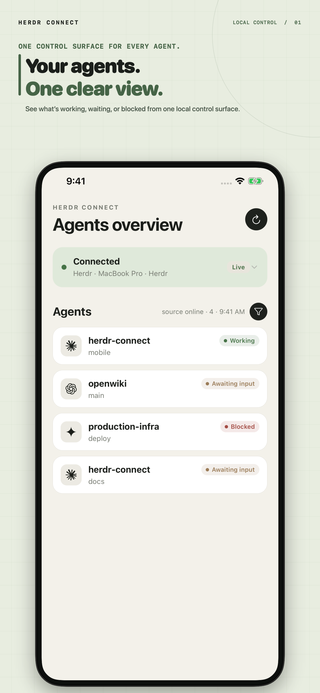
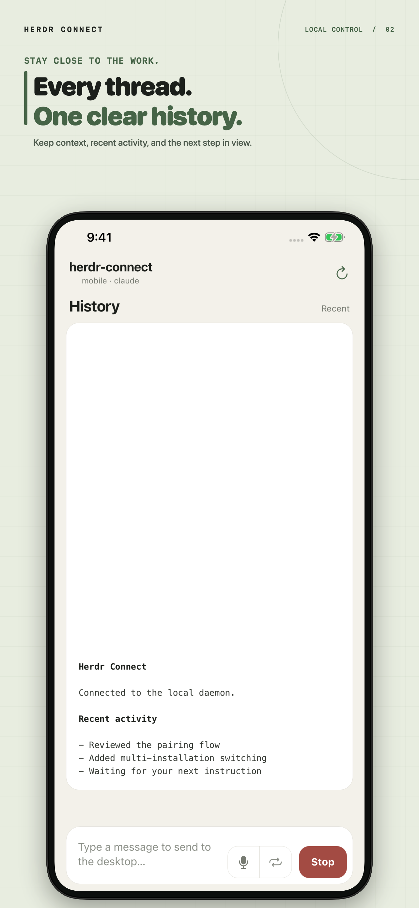
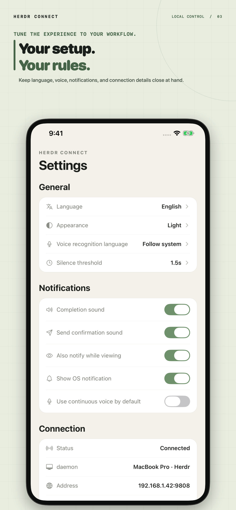

# Herdr Connect

[简体中文](docs/zh-CN/README.md)

**Control your Herdr agents from your iPhone — with no cloud in between.**

[](https://youtu.be/BxX4ijalnzI)

Herdr Connect is a companion app for [Herdr](https://github.com/ogulcancelik/herdr). See what every agent is doing, read their latest output, send a follow-up, and get a nudge when a job finishes — while your data stays on your own network.

<p>
  
  
  
</p>

## Why Herdr Connect

- **See everything at a glance** — every agent's status, workspace, and recent activity in one list
- **Stay close to the work** — read output, send instructions, or interrupt a running turn
- **Know when it's done** — sound, haptic, and notification cues when an agent finishes
- **Private by design** — the phone talks directly to your daemon over the local network. No cloud relay, no accounts, no telemetry

## Requirements

- A computer running [Herdr](https://github.com/ogulcancelik/herdr) with at least one agent
- An iPhone (Android is not yet available)
- Both devices on the same network — your Wi-Fi at home, or a VPN such as Tailscale that puts them on the same virtual LAN

## Quick start

1. Make sure Herdr is installed and has at least one agent:

   ```sh
   herdr agent list
   ```

2. Install the daemon on the computer running Herdr (the download needs no Go, Node.js, or Xcode):

   ```sh
   curl -fsSL https://raw.githubusercontent.com/Tomyail/herdr-connect/main/install.sh | sh
   ```

   On Windows, download and extract the zip from the [Releases page](https://github.com/Tomyail/herdr-connect/releases) instead.

3. Start it:

   ```sh
   ~/.local/bin/herdr-connect doctor
   ~/.local/bin/herdr-connect service install
   ```

4. Install the iOS app via the **[Herdr Connect TestFlight beta](https://testflight.apple.com/join/ZkRzJ6rm)** and allow Local Network access when prompted.

5. Pair your phone. This prints a one-time QR code — scan it from the app's Settings → Pair new device:

   ```sh
   herdr-connect pair
   ```

6. Open the Agents tab. Tap an agent to view its output, send messages, or interrupt it.

Something not connecting? Check that both devices are on the same network, pause VPNs that block local multicast, and look at firewall or guest-network isolation settings. The [daemon guide](docs/release/daemon.md) and [TestFlight troubleshooting](docs/release/ios-testflight.md) cover the details, and the [CLI guide](docs/cli.md) documents every command.

## How it works

```text
Herdr CLI
    │
Herdr Connect daemon   ← runs on your computer
    │
iPhone app             ← pairs, then talks to the daemon directly
```

The daemon and the app find each other on the local network. Trust is established once, by scanning a QR code from the pairing command; after that the phone only accepts the daemon it paired with. For the full trust model and its current limits, see [LAN TLS and pairing](docs/security/lan-tls-pairing.md).

## Project status

| Area | Status |
| --- | --- |
| iOS app | Public TestFlight beta |
| Discovery, pairing, secure transport | Implemented |
| Agent list, output, focus, messaging, interrupt | Implemented |
| Android | Not yet published |
| Off-network remote access (relay + E2EE) | Future milestone |

## FAQ

**Can I use it away from home?**
Not with an official relay — that is a future milestone. If you already run a mesh VPN like Tailscale, the app works fine across it as long as the phone can reach the daemon; you are responsible for the VPN's security.

**Does my data go to a server?**
No. The app talks directly to the daemon on your network. There is no cloud relay and no account system.

**Which Herdr versions are supported?**
The app and daemon negotiate versions and will prompt you to upgrade when they don't match. See the [daemon guide](docs/release/daemon.md).

## Documentation

| Audience | Start here |
| --- | --- |
| Install and pair | [Quick start](#quick-start), [daemon guide](docs/release/daemon.md), [TestFlight troubleshooting](docs/release/ios-testflight.md) |
| CLI reference | [CLI guide](docs/cli.md) |
| Security model | [LAN TLS and pairing](docs/security/lan-tls-pairing.md) |
| Architecture and contributor docs | [OpenWiki](openwiki/quickstart.md) |

## Develop from source

Setup, repository layout, and the full workflow live in OpenWiki: [development setup](openwiki/development/setup.md), [testing guide](openwiki/development/testing.md).

```sh
corepack enable
pnpm install --frozen-lockfile
pnpm demo:lan      # run a local daemon on TCP 9808
pnpm ios:mobile    # Expo development build on a physical iPhone
```

The app needs native modules (mDNS, pinned TLS, camera, notifications), so use an Expo development build, not Expo Go.

## Security

Do not report vulnerabilities or sensitive data in public issues — follow [SECURITY.md](SECURITY.md).

## Contributing

Bug reports, reproducible discovery or pairing failures, and design feedback are welcome in [GitHub Issues](https://github.com/Tomyail/herdr-connect/issues). Please read [CONTRIBUTING.md](CONTRIBUTING.md) first.

## Relationship to Herdr

Herdr Connect is an independent companion project, not affiliated with or endorsed by the Herdr project. Herdr is installed separately and remains subject to its own license.

## License

Licensed under the [Apache License 2.0](LICENSE).
