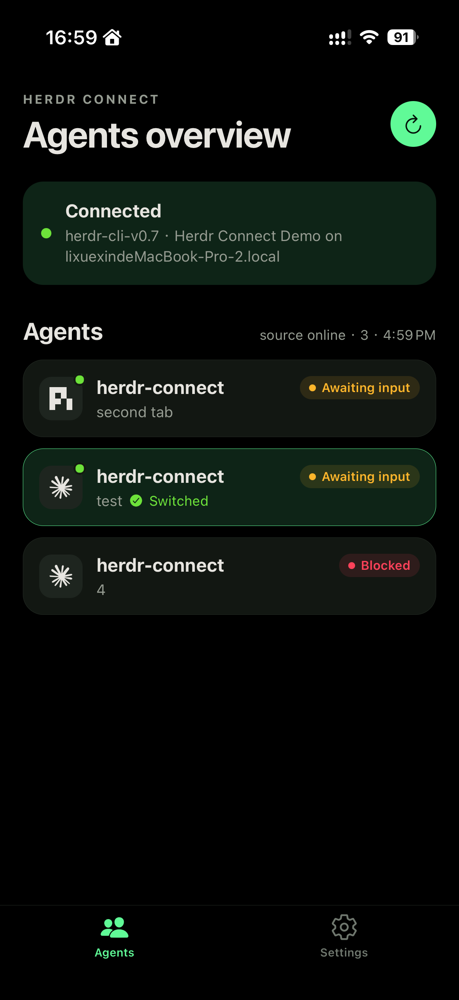
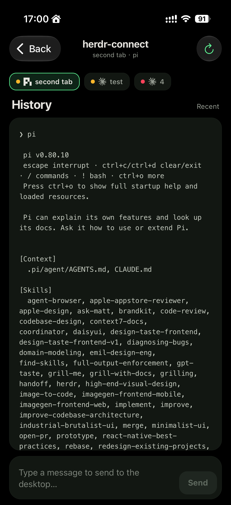

# Herdr Connect

[English](../../README.md)

Herdr Connect 是 [Herdr](https://github.com/ogulcancelik/herdr) 的本地优先配套工具。它让 iPhone 在同一局域网内发现附近的 Herdr Connect daemon、完成配对，并在不经过云服务转发 Agent 状态的前提下控制 Herdr Agent。

<p>
  
  
</p>

当前产品范围刻意限定为 LAN-only：daemon 与手机必须位于彼此可达的同一网络，数据路径留在这个网络内。远程 relay 访问是未来里程碑，不属于当前发布范围。

## 5 分钟开始使用

你需要一台正在运行 [Herdr](https://github.com/ogulcancelik/herdr) 的电脑、一部 iPhone，并确保两台设备位于同一个可达的局域网（物理 Wi-Fi，或能让两端互通的 VPN 虚拟局域网）。Android 目前尚未公开发布。

1. 确认 Herdr 已安装并且至少存在一个 Agent：

   ```sh
   herdr agent list
   ```

2. 安装 **v0.1.0-preview.2 daemon**。下载版 daemon 不需要 Go、Node.js、pnpm、Expo 或 Xcode。

   macOS 或 Linux：

   ```sh
   curl -fsSL https://raw.githubusercontent.com/Tomyail/herdr-connect/main/install.sh | sh
   ```

   Windows 用户从 [GitHub Releases](https://github.com/Tomyail/herdr-connect/releases/tag/v0.1.0-preview.2) 下载并解压对应的 zip。
3. 检查并启动 daemon。macOS/Linux 服务会在后台持续运行；Windows 用户在使用 App 期间需保持前台终端运行。

   macOS 或 Linux：

   ```sh
   ~/.local/bin/herdr-connect doctor
   ~/.local/bin/herdr-connect service install
   ~/.local/bin/herdr-connect service status
   ```

   Windows PowerShell 用户在解压目录中运行：

   ```powershell
   .\herdr-connect.exe doctor
   .\herdr-connect.exe --source herdr demo-lan
   ```

4. 在 iPhone 上加入公开的 **[Herdr Connect TestFlight 测试](https://testflight.apple.com/join/ZkRzJ6rm)**，安装 App，并在系统提示时允许“本地网络”访问。
5. 将手机与 daemon 配对：

   ```sh
   herdr-connect pair
   ```

   该命令会打印一次性 QR 码。在 App 中打开“设置 → 配对新设备”并扫描它。手机会 pin daemon 证书指纹，用一次性 secret 换取该设备专属的 bearer token，并把凭据保存在本机。
6. 回到 Agents 页面。App 应显示你的 Agents。点击 Agent 可以查看近期输出、切换焦点、发送文本、叫停运行中的 turn，或在前台收到完成提醒。

如果没有成功发现，请确认两台设备位于同一个可达局域网，暂时关闭会阻断本地 multicast 的 VPN，并检查防火墙或访客网络隔离设置。更多说明见 [daemon 指南](release/daemon.md)和 [TestFlight 故障排查](release/ios-testflight.md)。

完整命令、诊断输出、退出码和示例见 [CLI 指南](cli.md)。

> [!NOTE]
> LAN-only 是当前产品边界：Herdr Connect 面向你控制的本地网络设备，不把数据路径放到云端 relay。当前 LAN 传输使用 HTTPS、自签 ECDSA P-256 证书的 SHA-256 指纹 pinning、一次性 QR 配对、每设备 bearer token、设备撤销和限流。完整信任模型与边界（单 Owner、bearer-token auth、尚无消息层 E2EE）见 [LAN TLS 与配对](../security/lan-tls-pairing.md)。

## 项目状态

Herdr Connect 是 Herdr 的本地优先 LAN 控制界面。当前发布范围聚焦同一局域网内的 iOS 控制、配对和传输安全；远程 relay 访问与消息层 E2EE 是未来里程碑。

| 能力 | 状态 |
| --- | --- |
| Bonjour/mDNS daemon 广播 | 已实现 |
| iOS 真机发现 | 已开放公开 TestFlight beta |
| 配对与 LAN 鉴权 | QR 配对、pinned TLS、每设备 bearer token、撤销 |
| Agent 列表、近期输出、焦点切换、文本输入、叫停 | 已认证的 LAN API |
| 本地完成提示 | 前台声音 / 震动 / 本地通知 |
| API 兼容性 | daemon/app 版本协商与升级提示 |
| Android App / APK | 尚未发布 |
| 消息层 E2EE 与 relay 远程访问 | 未来里程碑 |

## 当前范围

当前公开范围是 **LAN-only 控制**：

- Go daemon 广播 `_herdr-connect._tcp`；
- 使用 TLS 指纹 pinning 与 QR 配对保护 LAN 传输；
- 在本机管理已配对设备（`herdr-connect devices list` / `revoke`）；
- iPhone 在同一可达局域网内发现并配对 daemon；
- 展示 Agent 状态、近期历史、焦点控制、文本输入和叫停；
- 在前台提供完成提示（App 内红点、声音、震动、本地通知）；
- 为本地网络权限、VPN、multicast、防火墙、客户端隔离和版本不匹配问题提供诊断。

发现只能证明实例可达；信任由 QR 配对和证书 pinning 建立。官方远程 relay 连接明确不属于当前发布范围。

## 通过 VPN 远程使用（非官方）

Herdr Connect 目前没有官方远程连接产品。如果你已经信任并维护 Tailscale 这类 mesh VPN，可以把手机和 daemon 主机放进同一个虚拟局域网；只要两端彼此可达，Herdr Connect 本身无需改代码即可在“地理位置不同但逻辑同网”的场景下工作。App 只需要能访问 daemon，并继续使用同一套 TLS pinning 与配对流程；它不关心这个 LAN 是物理 Wi-Fi 还是 VPN 接口。

这是一种非官方部署方式，不是产品承诺。VPN 的访问控制、路由、DNS/multicast 行为和设备安全由你负责。官方远程路线会采用 relay + 消息层 E2EE 设计。

## 文档

| 读者 | 从这里开始 |
| --- | --- |
| 安装与配对 | [5 分钟开始使用](#5-分钟开始使用)、[daemon 指南](release/daemon.md)、[TestFlight 故障排查](release/ios-testflight.md) |
| CLI 参考 | [CLI 指南](cli.md) |
| LAN 安全模型 | [LAN TLS 与配对](../security/lan-tls-pairing.md) |
| 架构、领域模型与贡献者深度文档 | [OpenWiki](../../openwiki/quickstart.md)（英文） |
| 历史上的配对前 demo | [已归档 LAN iOS demo 指南](../demo/lan-ios-agent-list.md) |

OpenWiki 是面向代码的活文档（架构、adapter、projection、协议说明、开发环境与测试）。README 不再重复这些细节，请优先查阅 OpenWiki。

## 架构

```text
Herdr CLI
    │ 命令行参数与 JSON
    ▼
Herdr Connect daemon
    │ Bonjour / mDNS + HTTPS LAN API（pinned TLS、bearer-token auth）
    ▼
Expo / React Native 移动客户端
```

Herdr 作为独立程序运行，必须单独安装。Herdr Connect 通过 CLI 与其交互，不嵌入或链接 Herdr 源码。

组件职责、数据流与源码地图见 [architecture overview](../../openwiki/architecture/overview.md)（英文）。

## 从源码开发

贡献者环境、仓库布局、常用 `pnpm` 命令和完整开发流程见 OpenWiki：

- [Development setup](../../openwiki/development/setup.md)（英文）
- [Testing guide](../../openwiki/development/testing.md)（英文）

只想使用下载版 daemon 和 TestFlight App 时，请按照[“5 分钟开始使用”](#5-分钟开始使用)操作。

克隆仓库后的最小路径：

```sh
corepack enable
pnpm install --frozen-lockfile
pnpm demo:lan      # daemon 监听 TCP 9808，广播 _herdr-connect._tcp
pnpm ios:mobile    # 在 iPhone 真机上安装 Expo development build
pnpm dev:mobile    # 后续开发只需启动 Metro
```

移动端依赖原生模块（Bonjour、pinned TLS fetch、相机配对、通知），必须使用 Expo development build，不能用 Expo Go 代替。历史 [LAN iOS demo 指南](../demo/lan-ios-agent-list.md) 仅作为配对机制上线前流程的归档保留。

## 路线图

1. 继续完善 LAN-only 产品：可靠性、版本兼容、App Store 准备和所有者体验。
2. 当 LAN 模型和原生模块在 Android 上准备好后发布 Android。
3. 在后续里程碑中通过 relay 与消息层 E2EE 增加安全远程连接。

路线图会根据真实使用反馈调整，但当前发布承诺是本地优先的 LAN 控制。

## 安全

不要在公开 Issue 中报告漏洞、凭据、私有 prompt、Agent 输出或敏感路径。请按照[安全政策](SECURITY.md)中的私密报告说明操作。

当前 LAN 传输在连接层加密并鉴权。消息层 E2EE 尚未集成，它属于 Protocol v1 文档描述的未来 relay 里程碑。当前保证与边界请从 [LAN TLS 与配对](../security/lan-tls-pairing.md) 开始阅读。

## 贡献

欢迎通过 [GitHub Issues](https://github.com/Tomyail/herdr-connect/issues) 提交缺陷、可复现的 LAN 发现或配对失败、文档修正和设计反馈。

提交代码前，请先创建 Issue，确认改动属于当前 LAN-only 范围或已接受的路线图事项。请阅读[贡献指南](CONTRIBUTING.md)和仓库约定 [AGENTS.md](../../AGENTS.md)。

社区政策：[行为准则](CODE_OF_CONDUCT.md)、[安全政策](SECURITY.md)和[隐私政策](PRIVACY.md)。

## 与 Herdr 的关系

Herdr Connect 是独立的配套项目，与 Herdr 项目不存在隶属或官方背书关系。Herdr 需要单独安装，并遵守其自身许可证与项目政策。

## 许可证

本项目采用 [Apache License 2.0](../../LICENSE)。
