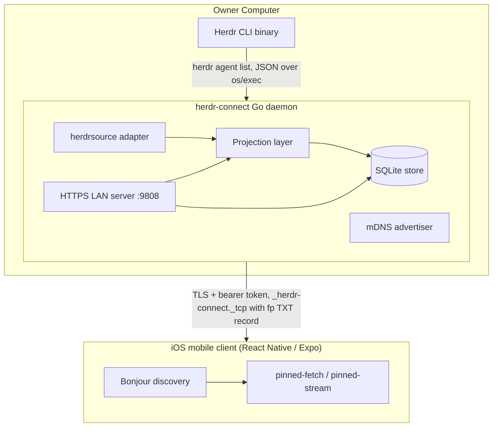
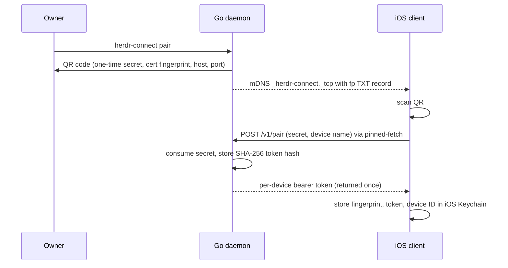

# System Architecture

Herdr Connect follows a three-tier architecture: the **Herdr CLI** provides raw data, the **Go daemon** projects and serves it over HTTPS with bearer-token authentication, and the **mobile client** discovers, pairs with, and consumes the authenticated API. A separate **protocol package** defines cryptographic primitives for future end-to-end encryption over relay connections.

## Core Components

Diagram: components and data flow from the Herdr CLI through the daemon's projection layer and SQLite-backed HTTPS API to the mobile client.

## Go Daemon

The daemon entrypoint (`/cmd/herdr-connect/main.go`) is a thin shell: it wires a signal-aware context into `daemoncli.ExecuteVersion` and provides a source factory. The factory selects between the real `herdr` CLI adapter (binary resolved from `HERDR_CONNECT_HERDR_PATH`, defaulting to `herdr` on PATH) and a `fake` in-process source with full capabilities used for testing and demos. All command dispatch, versioning, and I/O live in `internal/daemoncli`.

The long-lived daemon:

1. **Adapts Herdr CLI output** — The [Herdr Source Adapter](../domain/herdr-source-adapters.md) invokes `herdr agent list` and parses the response into domain types, addressing each agent by its `pane_id`
2. **Projects agent state** — The [Projection Layer](../domain/agent-projection.md) normalizes source observations and persists them to SQLite
3. **Serves HTTPS API** — The LAN server (`/internal/demolan/server.go`) serves agent list, output, focus, messages, interrupt, and SSE endpoints over HTTPS with bearer-token auth on TCP port 9808
4. **Advertises via mDNS** — The daemon publishes a `_herdr-connect._tcp` Bonjour service with a `fp` TXT record containing the TLS certificate fingerprint for mobile pairing verification

### Key Daemon Responsibilities

- **Command execution** — Invokes Herdr CLI commands via `os/exec` and parses JSON output
- **State synchronization** — Calls `source.Snapshot()` periodically and projects changes to SQLite, with a 1-second TTL cache and singleflight coalescing to avoid redundant CLI spawns during polling; the REST handler and the SSE broadcaster share the same cached snapshot function so adding SSE does not increase net CLI call rate
- **HTTPS serving** — Serves TLS-encrypted endpoints with self-signed certificate and per-device bearer-token authentication
- **Rate limiting** — Token-bucket limits per device (reads: 5/s burst 10, writes: 1/s burst 3) and per IP for pairing/unauthenticated requests (1/s burst 20); responses exceeding limits return `429` with `rate_limited` and `Retry-After: 1`
- **SSE stream management** — A per-device stream connection limiter bounds concurrent SSE connections, and the broadcaster polls only while subscribers exist
- **Diagnostics** — Checks database health, source availability, and port readiness; all responses (including 401 errors) carry `X-Herdr-Connect-Api-Version`, which the CLI liveness probe relies on

### Service lifecycle

The `internal/daemonservice` package defines a platform `Manager` interface (`Install`, `Status`, `Logs`, `Restart`, `Uninstall`) with implementations for macOS launchd and Linux systemd user services. Installation requires absolute paths for both the daemon executable and the Herdr binary, refuses to overwrite a service config lacking the "Managed by Herdr Connect CLI" marker, and rolls back the previous config if reload or start fails. Windows service management is not supported (`newManager` returns an error for other OSes); on Windows the daemon runs in the foreground only.

- **macOS**: `~/Library/LaunchAgents/com.tomyail.herdr-connect.plist`, logs under `~/Library/Logs/Herdr Connect/` (created with `0700`/`0600` permissions)
- **Linux**: `~/.config/systemd/user/herdr-connect.service`

The service resolves absolute paths to both Herdr Connect and Herdr binaries at install time and stores them in the service configuration. Moving or deleting either binary breaks the service.

## Mobile Client

The iOS app (`/apps/mobile/`) is a React Native application that:

1. **Pairs with the daemon** — Scans a QR code rendered by `herdr-connect pair` to exchange a one-time secret for per-device bearer credentials, stored in iOS Keychain
2. **Discovers the daemon** — Uses `@inthepocket/react-native-service-discovery` to browse `_herdr-connect._tcp` services
3. **Fetches agent state** — Calls `GET /v1/agents` over HTTPS using a pinned-fetch native module that validates the server's TLS certificate fingerprint; a companion pinned-stream native module consumes SSE signals for real-time updates
4. **Displays status** — Shows agents with interaction state, outcome, and brand icons
5. **Interacts with agents** — Calls `/history`, `/focus`, `/messages`, and `/interrupt` endpoints for control

The client requires an Expo development build due to native Bonjour and pinned-fetch modules; Expo Go is not sufficient.

### Screenshot harness native module

The `screenshot-launch-options` Expo module (`/apps/mobile/modules/screenshot-launch-options/`) is an iOS-only native module that reads simulator launch arguments (`-appStoreScreenshotScene`, `-appStoreScreenshotLocale`) via `ProcessInfo` and exposes them to JavaScript, letting the App Store screenshot harness (`ios-screenshots.mjs`, `compose_app_store_screenshots.swift`) select a scene and locale through `xcrun simctl launch` without rebuilding the JS bundle. The JavaScript wrapper keeps the native lookup optional (try/catch around `requireNativeModule`), so Expo Go and Android can still load the bundle. `App.tsx` additionally guards the screenshot route behind the compile-time `__DEV__` flag, so the module cannot enable hidden screens in a production build. Because it is a plain Expo module resolved through autolinking, it requires no plugin entry or other change in `app.config.ts`.

### Key Client Screens

- **Agents Screen** (`AgentsScreen.tsx`) — Lists all discovered agents with status pills; shows pairing/revoked/error state when not connected
- **Agent Detail** (`AgentDetail.tsx`) — Shows recent output, focus switcher, text input, and interrupt button with confirmation dialog
- **Settings** (`SettingsScreen.tsx`) — Language, appearance, pairing, and diagnostic options
- **Pairing** (`PairingScreen.tsx`) — Full-screen QR scanner for pairing with the daemon

## Protocol Package

The protocol package (`/packages/protocol/`) defines cryptographic primitives for **future end-to-end encryption** over remote relay connections:

- **HPKE hybrid encryption** — X25519 key exchange, HKDF-SHA256, ChaCha20Poly1305
- **Ed25519 signatures** — For device authentication and message integrity
- **Message types** — SessionHello, PairingRequest, PairingDecision, LifecycleEvent, StateSnapshot, RemoteCommand, etc.
- **Replay protection** — Event-based sequencing and TTL enforcement
- **Error codes** — Well-defined protocol error types

The protocol is **not yet integrated** into the LAN transport. Today's LAN security uses TLS with certificate fingerprint pinning and bearer-token pairing (see [Secure Pairing & TLS Protocol](../protocol/secure-pairing.md)). The HPKE protocol will provide end-to-end encryption for the future relay milestone.

## Data Flow

### Discovery & Pairing Flow

Diagram: QR-code pairing exchange producing per-device bearer credentials pinned to the advertised certificate fingerprint.

1. Owner runs `herdr-connect pair` → generates one-time secret, renders QR with secret + cert fingerprint + host addresses + port
2. Mobile app scans QR, POSTs secret + device name to `POST /v1/pair` via pinned-fetch (validates cert fingerprint)
3. Server consumes secret, issues per-device bearer token, returns it exactly once
4. Mobile stores credentials (fingerprint, token, device ID) in iOS Keychain
5. Daemon advertises `_herdr-connect._tcp` with `fp` TXT record containing cert fingerprint
6. Mobile discovers daemon via Bonjour, connects using stored credentials

### State Synchronization Flow

1. Daemon calls `source.Snapshot()` to fetch current agents from Herdr CLI (cached with 1-second TTL and singleflight coalescing; shared by REST handlers and the SSE broadcaster)
2. Projection layer normalizes observations and applies batch updates to SQLite
3. Server reads from SQLite on each authenticated HTTP request
4. If source is offline, server returns last known state with `source_online: false`
5. Server emits SSE signals (`{cursor, online}`) to connected mobile clients on real state changes; clients then re-fetch `/v1/agents` for full data. SSE polling only runs while at least one subscriber is connected, and per-device concurrent stream connections are capped.

### Interaction Flow

1. User taps agent → Client calls `GET /v1/agents/{sourceId}/history`
2. Server invokes Herdr CLI to read last 120 lines of agent output (with TUI chrome stripping; responses over `MaxMessageSize` are truncated)
3. User sends text → Client calls `POST /v1/agents/{sourceId}/messages`
4. Server invokes Herdr CLI to send text to agent pane and submit Enter
5. User interrupts → Client calls `POST /v1/agents/{sourceId}/interrupt` (requires confirmation dialog on mobile)
6. Server invokes Herdr CLI to send SIGINT/Ctrl-C to agent pane

## Design Principles

### Local-First by Default

All state persists locally on the owner's computer. The daemon does not depend on cloud services. Discovery works only on the same LAN segment.

### Unidirectional Projection

The daemon projects Herdr state outward but does not modify Herdr's internal state except through explicit user commands (focus, send message, interrupt). It does not bidirectionally sync.

### CLI Boundary

Herdr Connect communicates with Herder through its documented CLI interface only. It does not embed Herdr source code, link against Herdr libraries, or call internal APIs. The source abstraction (`internal/herdrsource`) keeps this boundary swappable — `cmd/herdr-connect/main.go` selects the `herdr` adapter or the in-process `fake` source by name.

### LAN Security Boundary

All LAN traffic is encrypted with TLS using a self-signed ECDSA P-256 certificate. Mobile devices pin the certificate's SHA-256 fingerprint and authenticate with per-device bearer tokens obtained through [QR-code pairing](../protocol/secure-pairing.md). Tokens are stored only as SHA-256 hashes on the daemon side. The daemon enforces per-device and per-IP rate limits. There is no end-to-end encryption layer yet — TLS terminates at the daemon. The HPKE-based protocol package will add E2EE for the future relay milestone.

## Cross-Platform Considerations

### Go Dependencies

- `github.com/grandcat/zeroconf` — mDNS/Bonjour advertising
- `modernc.org/sqlite` — Pure Go SQLite, no CGO
- `golang.org/x/sys` — Platform-specific service installation and data-directory permissions (`internal/lanauth`)
- `golang.org/x/time/rate` — Token-bucket rate limiting
- `golang.org/x/sync/singleflight` — Snapshot call coalescing
- `crypto/tls`, `crypto/ecdsa` — Self-signed TLS certificate generation and HTTPS serving

### React Native Dependencies

- `@inthepocket/react-native-service-discovery` — Native Bonjour browsing (requires dev build)
- `expo-camera` — QR scanning for pairing
- `expo-secure-store` — iOS Keychain credential storage
- `react-native-mmkv` — Fast local storage for settings
- `@react-navigation/*` — Navigation stack and tab bar
- **pinned-fetch** (custom Expo module) — Native iOS TLS fingerprint pinning via URLSession delegate
- **pinned-stream** (custom Expo module) — Native iOS TLS-pinned SSE stream consuming `/v1/agents/events`; shares `PinnedTrustEvaluator` with pinned-fetch
- **screenshot-launch-options** (custom Expo module) — iOS-only simulator launch-argument reader for the App Store screenshot harness; optional at load time, `__DEV__`-guarded at the route level
- `expo-notifications` / `expo-haptics` — Foreground local notifications and haptic feedback on agent completion
- `expo-audio` — Completion sound chime playback

### Platform Support Matrix

| Feature | macOS | Linux | Windows | iOS |
|---------|-------|-------|---------|-----|
| Daemon binary | ✅ | ✅ | ✅ | — |
| Background service | ✅ (launchd) | ✅ (systemd user) | ❌ | — |
| mDNS advertising | ✅ | ✅ | ✅ | — |
| Mobile client | — | — | — | ✅ (TestFlight) |
| Android client | — | — | — | ❌ (planned) |

For implementation details of each component, see their respective domain and development sections.
