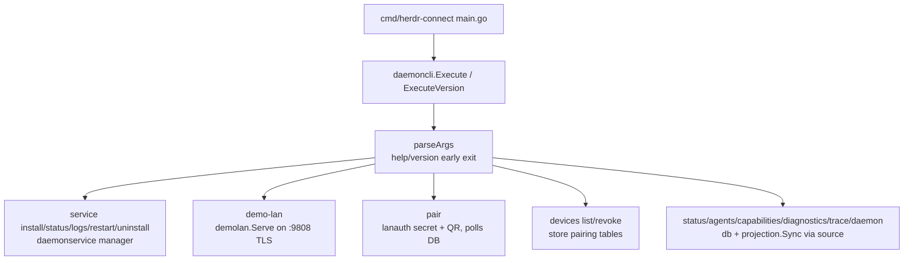

# CLI Commands

The `herdr-connect` CLI (`/internal/daemoncli/cli.go`, entry point `/cmd/herdr-connect/main.go`) provides commands for diagnosing the installation (`doctor`), managing the background service, running the LAN server (`demo-lan`), [pairing](../protocol/secure-pairing.md) mobile devices, and managing paired devices. All commands share global options and consistent output conventions.



## Global Options

Options must appear before the command name (both `--flag value` and `--flag=value` forms are accepted):

```text
--source <name>   Source adapter (herdr|fake). Defaults to herdr.
--db <path>       SQLite database path. Defaults to owner's config directory.
-h, --help        Show help without contacting Herdr or opening SQLite.
--version         Show build version without contacting Herdr or opening SQLite.
```

Usage errors (unknown option, missing value, bad command) exit with code `2`; unknown commands additionally print a "Did you mean" suggestion computed by edit distance (`suggestCommand`).

### Database Path

Default locations by platform:

- **macOS**: `~/Library/Application Support/herdr-connect/daemon.db`
- **Linux**: `~/.config/herdr-connect/daemon.db`
- **Windows**: `%LOCALAPPDATA%\herdr-connect\daemon.db`

Override with `--db` for testing or to run multiple instances. The certificate used by the LAN server lives next to the database (`lanauth.CertFileName` in the same directory), which is also where `pair` reads the TLS fingerprint.

### Source Selection

- `herdr` — Real Herdr CLI adapter (default)
- `fake` — Fake source for development (see [Herdr Source Adapters](../domain/herdr-source-adapters.md))

`migrations`, `pair`, and `devices` skip the source adapter entirely (`prepareCommand` opens only the database) — they touch pairing/device tables, never the Herdr source.

## Commands

### doctor

Diagnose the installation and show the next step:

```sh
herdr-connect doctor
herdr-connect doctor --json
```

Checks performed (each becomes part of the report):

1. **Database** — can SQLite be opened; prints schema version
2. **Herdr CLI/source** — is the source online (projection sync)
3. **Agents** — how many agents are visible
4. **LAN preview port** — TCP 9808: available, running, or occupied

`doctor` computes the preview status through `checkPreview`, which probes the loopback endpoints `https://127.0.0.1:9808` and `https://[::1]:9808` with a 500 ms timeout. A live endpoint is recognized by the `X-Herdr-Connect-Api-Version` header or an `api_version` JSON marker; when a local certificate exists, the probe additionally pins the server certificate to the local installation identity by SHA-256 fingerprint (no credentials are sent). If the endpoint does not answer, it falls back to a bind test to distinguish *available* from *occupied*.

Text output uses `[OK]` / `[WARN]` / `[FAIL]` lines plus a `Next:` line that adapts to the failure mode (install/start Herdr, start an agent, free port 9808 via `lsof -nP -iTCP:9808 -sTCP:LISTEN`, build a persistent binary instead of `go run`, or run `service install`). Exit code is `1` when the source is offline, no agents exist, or the port is occupied; otherwise `0`.

### service

Manage the background service (macOS launchd / Linux systemd user service; `daemonservice.New` errors on other platforms):

```sh
herdr-connect service install [--herdr ABSOLUTE_PATH]
herdr-connect service status [--json]
herdr-connect service logs [--tail]
herdr-connect service restart
herdr-connect service uninstall
```

#### service install

Installs and starts the service running `herdr-connect --source herdr demo-lan`. Resolves absolute paths to both the Herdr Connect and Herdr binaries (via `--herdr` or `exec.LookPath("herdr")`), validates they are executable files, and refuses to run from a `go-build` temporary binary or `.test` binary. If the service is not already installed, it first checks that TCP 9808 is actually available (an occupied port aborts with an error). Installation waits for the LAN preview endpoint to become ready (`waitForPreview`, up to 20 attempts × 250 ms) and reports failure if it never does. Refuses to overwrite an unmanaged service config file. Exit `0` on success, `1` on any failure.

#### service status

Reports installed/running state, PID, manager (launchd/systemd), config path, Herdr path, preview status, source online, agent count, and a computed `healthy` flag (`running && preview running && source online`). `--json` emits a structured report; without it, human-readable text. Exit `0` when healthy, `1` when installed but unhealthy or on error, `3` when not installed.

#### service logs

Prints recent service logs (macOS: `~/Library/Logs/Herdr Connect/daemon.log` and `daemon.error.log`). `--tail` follows new output. Exit `3` if the service is not installed.

#### service restart

Restarts the service and re-verifies that the LAN preview becomes ready. Exit `3` if not installed.

#### service uninstall

Stops the service and removes the managed configuration. Preserves the CLI binary, database, and logs. Refuses to remove a config file it did not create.

### demo-lan

Start the LAN preview server in the foreground:

```sh
herdr-connect demo-lan
# Or with explicit source:
herdr-connect --source herdr demo-lan
```

On startup the command prints a safety notice to stderr before any initialization output; if the context is already cancelled (immediate SIGINT) it exits cleanly with 0.

The server (`demolan.Serve`):

- Listens on TCP 9808 with TLS (self-signed certificate persisted next to the database)
- Advertises `_herdr-connect._tcp` via mDNS (macOS; no-op elsewhere)
- Requires bearer-token authentication on all endpoints except `/v1/pair`
- Enforces per-device and per-IP rate limits
- Checks a client-version header: requests declaring `X-Herdr-Connect-Client-Version` below `MinSupportedClientVersion` (1) get `426 client_outdated` before any other handling; a missing header is allowed (curl probes, `doctor` liveness checks)

The service wrapper runs this command in the background (`demo-lan`, not `daemon`).

### daemon

Run the periodic synchronization daemon:

```sh
herdr-connect daemon
herdr-connect daemon --once  # Perform one sync and exit
```

`--once` is useful for health checks in scripts. This is the only command that accepts an argument.

### pair

Generate a pairing QR code for a mobile device:

```sh
herdr-connect pair
herdr-connect pair --host 192.168.1.20      # or --host=IP_ADDRESS
```

Before opening the database, the CLI probes the preview port; if the LAN daemon is not running it exits immediately with code `1` and the hint to start `herdr-connect demo-lan` — no DB file is created and no source adapter is touched.

Then the command (`/internal/daemoncli/pair.go`):

1. Loads the self-signed TLS certificate and its SHA-256 fingerprint
2. Generates a one-time secret (`lanauth.NewPairingSecret`), stored as SHA-256 hash with a 5-minute TTL
3. Renders a terminal QR code containing `{v:1, fp, hosts[], port:9808, secret}`
4. Polls the database every second until the secret is consumed or the TTL plus a 10-second margin expires

The mobile device scans the QR, POSTs the secret to `/v1/pair`, and receives a per-device bearer token. The CLI prints the paired device name on success. Exit code 1 on timeout. Pairing is auto-approved — physical access to the terminal screen is the out-of-band confirmation (see [Secure Pairing](../protocol/secure-pairing.md)).

#### pair --host

`--host IP_ADDRESS` limits the QR to a single address instead of all active local addresses. Use it on multi-interface hosts to force one pairing path — the physical-LAN address for local pairing, or the host's Tailscale/VPN address to pair from outside the physical LAN.

Validation (`parsePairHost` in `/internal/daemoncli/cli.go`, `selectPairHosts` in `/internal/daemoncli/pair.go`):

- Only `--host IP` or `--host=IP` is accepted; any other argument is rejected with exit code 2
- The value must parse as an IP address (`net.ParseIP`)
- The address must be assigned to an active local interface (compared canonically, so compressed and expanded IPv6 spellings match); otherwise the command errors out

When pairing over Tailscale, both the daemon host and phone must be on the same tailnet; find the host address with `tailscale ip -4`. Cold-launch reconnect off-LAN is not yet supported: startup rediscovery is mDNS-only, which does not traverse the tunnel. Focused tests: `TestParsePairHost`, `TestSelectPairHostsLimitsQRAddresses`, `TestContainsHostComparesCanonicalIPValues` in `/internal/daemoncli/pair_test.go` (`go test ./internal/daemoncli/ -run 'PairHost|SelectPairHosts|ContainsHost'`).

### devices

List and revoke paired devices (database-only; no source adapter):

```sh
herdr-connect devices list
herdr-connect devices revoke <device_id>
```

#### devices list

Outputs a JSON array of paired devices, empty array (never `null`) when none:

```json
[
  {
    "device_id": "dev_abc123",
    "name": "My iPhone",
    "paired_at": "2025-06-18T10:30:00Z",
    "last_seen_at": "2025-06-18T12:00:00Z",
    "status": "active",
    "revoked_at": null
  }
]
```

Timestamps are RFC 3339 UTC. Status is `"active"` or `"revoked"`.

#### devices revoke

Revokes a paired device by ID via `lanauth.RevokeDevice`. The device's bearer token is immediately rejected with `401 revoked` on subsequent requests. Errors (exit `1`) if the device is not found or already revoked; exit `2` for wrong argument count. Revocation is host-side only — no remote recovery; the device must re-pair. Focused tests: `/internal/daemoncli/devices_test.go`.

### agents

```sh
herdr-connect agents
```

Prints the current agent list from the projection as a JSON array. If the Herdr source is unavailable, it exits with an error pointing to `doctor` instead of falling back to stale state.

### status

```sh
herdr-connect status
```

Prints the full projected source state as JSON (agents, capabilities, `through_event_seq`). Unlike `agents`, when sync fails it falls back to the last persisted state loaded from the database.

### capabilities

```sh
herdr-connect capabilities
```

Prints source capabilities as JSON; the only command that needs a source adapter but not the database.

### diagnostics

Compatibility command for existing scripts; accepts only `--json`. Prints a flat diagnostics object (database path, schema version, source name/online, agent count, `through_event_seq`, plus `source_error: "source_unavailable"` when the live sync failed).

### migrations

```sh
herdr-connect migrations
```

Outputs `{"database": "<path>", "schema_version": N}` after opening the database.

### trace

Development command that prints a live stream of source events as they occur. Not for normal use.

### version

```sh
herdr-connect version
herdr-connect --version
```

Prints `herdr-connect <version>`. Source builds without release metadata report `development` (`DevelopmentVersion`, applied by `normalizedVersion`).

## Output Conventions

- **stdout** — JSON output, help text, version information
- **stderr** — errors, warnings, the `demo-lan` safety notice
- **Exit codes** — `0` success; `1` runtime or health-check failure; `2` invalid usage; `3` service not installed (service lifecycle commands only)
- JSON output is produced by `writeJSON` and is always valid on stdout even when the command fails

## LAN Server Security Model

Unlike earlier milestones, `demo-lan` is **not** an unauthenticated plaintext server. All traffic is TLS with a pinned self-signed installation certificate, and every endpoint except `/v1/pair` requires a per-device bearer token obtained through pairing.

- **Client version gate** (`/internal/demolan/auth.go`): `enforceClientVersion` runs before all other handling on every path (including `/v1/pair`) so that outdated clients receive `426 client_outdated` even when unpaired; requests without the version header are allowed through.
- **Pairing endpoint**: `/v1/pair` exchanges the one-time secret from the QR code for a `device_id`, bearer token, and certificate fingerprint; bodies are capped at 4096 bytes and device names at 100 bytes.
- **Device self-revocation**: `/v1/device` is handled in the secure layer itself once the token is resolved to a device ID.
- **Rate limiting** (`/internal/demolan/rate_limit.go`): token buckets per device — reads 5 req/s burst 10, writes 1 req/s burst 3 (writes drive the Herdr CLI and the user's terminal) — and per IP 1 req/s burst 20 for `/v1/pair` and unauthenticated requests; over-limit requests get `429 rate_limited` with `Retry-After: 1`. The limiter is in-memory with no eviction, sized for a LAN-scale number of devices/IPs. Focused tests: `/internal/demolan/auth_test.go`, `/internal/demolan/rate_limit_test.go`, `/internal/demolan/sse_test.go`.

Operational guidance remains: run only on a trusted LAN, revoke devices you no longer use (`devices revoke`), and do not expose port 9808 to the internet.

## Testing Seams

`daemoncli` exposes deterministic seams used by its tests (`/internal/daemoncli/cli_test.go`):

- `ExecuteWithPreviewChecker` injects a fake preview-port probe so `service`/`pair`/`doctor` tests never bind real sockets.
- `pairDeps` in `pair.go` injects secret creation, polling, address collection, QR rendering, clock, and sleep.
- `secureHandlerWithLimiter` in demolan injects (or disables) the rate limiter for HTTP tests.

## Development Commands

- `--source fake` — fake source instead of the real Herdr CLI
- `trace` — live event stream
- `daemon --once` — single sync for health checks

See [Development Setup](../development/setup.md) for the development workflow.
