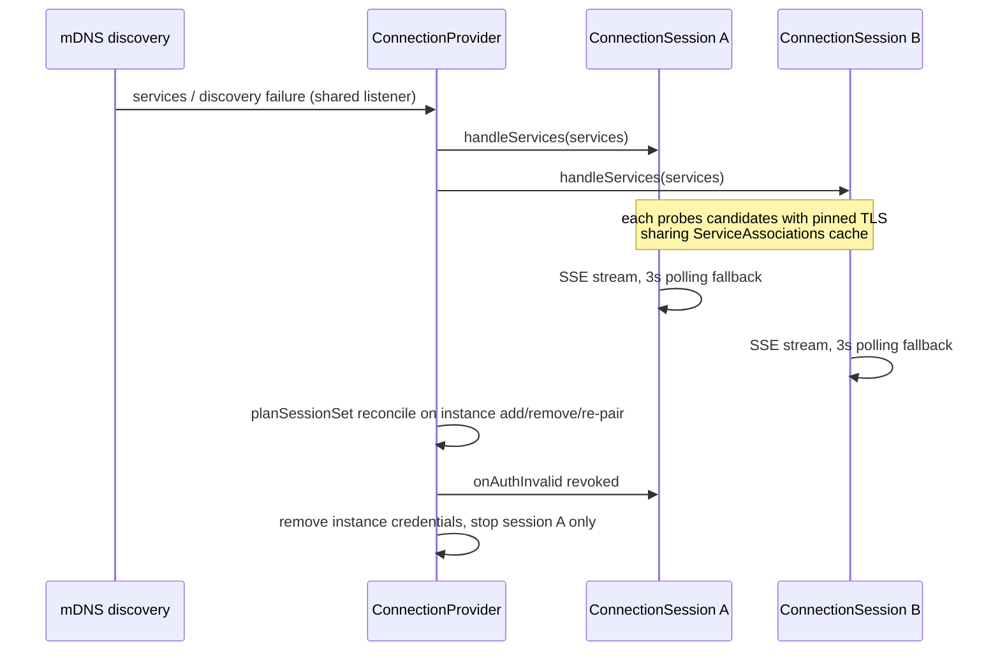
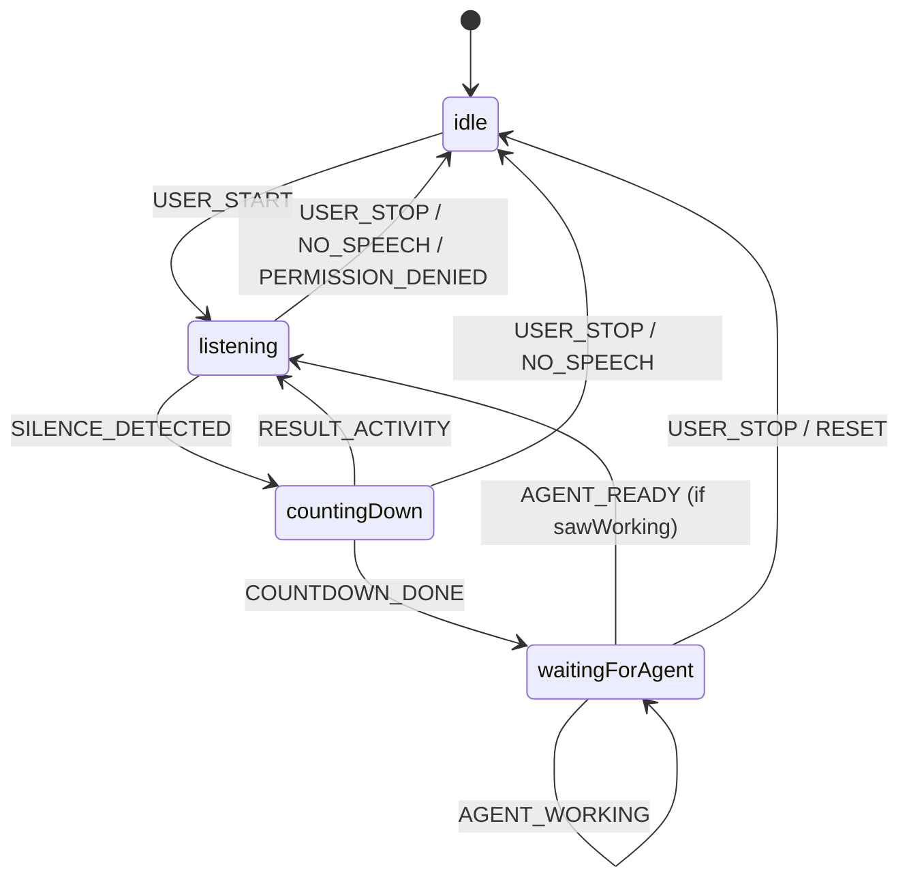

# iOS Mobile Client

The iOS client (`/apps/mobile/`) is a React Native application that pairs with one or more Herdr Connect daemon installations via QR code, discovers daemons via Bonjour, displays agent state, and interacts with agents (view output, switch focus, send text, interrupt). Each paired installation gets its own credential record and its own parallel connection session; switching instances is instant because all sessions stay live. The app is distributed via TestFlight beta and requires a development build due to native service discovery and pinned-fetch modules.

## Architecture

The app adapts to the current window width, not the device type. Below a 768pt breakpoint it uses a phone-style narrow layout; at or above the breakpoint it switches to a three-column split-view layout. Both layouts share the same two top-level destinations (Agents, Settings), and selection state (active destination + selected agent) is lifted into `AppShell` (`App.tsx`) so it survives live resize across the breakpoint.

### Responsive Layout (`layout.ts`, `SplitLayout.tsx`)

The single width threshold is `SPLIT_BREAKPOINT = 768` in `/apps/mobile/src/layout.ts`. The `useIsWideLayout()` hook drives the layout branch in `AppShell`:

- **Narrow mode (< 768pt)** — `ThemedNavigation` uses a bottom tab bar + native-stack detail screens (see below). This is the layout iPhones always see and the layout iPad mini portrait sees by design (744pt is below the breakpoint).
- **Wide mode (≥ 768pt)** — `SplitLayout` (`SplitLayout.tsx`) renders a fixed 220pt sidebar + 340pt list column + flexible detail column. The sidebar replaces the tab bar; the list and detail are side-by-side instead of push-navigated.

The 768pt threshold was chosen so the fixed columns (220 + 340 = 560pt) leave enough remaining width for a usable detail pane at iPad sizes. It is a width check, not a device-type check, so any window resized across it (iPad Split View, Slide Over, Stage Manager) switches layouts live.

#### Narrow Tab Layout

The app uses React Navigation with a tab-based structure:

```
App
 └─ NavigationContainer
      ├─ Tab.Navigator
      │   ├─ Agents Screen (agents list)
      │   └─ Settings Screen (settings tabs)
      └─ Stack.Screen (detail screens)
           ├─ Agent Detail (output, focus, input, interrupt, voice)
           ├─ Pairing (QR scanner)
           ├─ Language (localization)
           ├─ Appearance (theme)
           ├─ VoiceLanguage (voice recognition language)
           └─ SilenceThreshold (continuous-mode silence gap)
```

#### Wide Split Layout

```
AppShell
 └─ SplitLayout
      ├─ Sidebar (220pt) — Agents / Settings destinations
      ├─ List Column (340pt)
      │   ├─ AgentsScreenContent (when destination = Agents)
      │   └─ SettingsCategoryList (when destination = Settings)
      └─ Detail Column (flex)
           ├─ AgentDetailColumn — inline header with focus toggle (Agents)
           └─ SettingsDetailColumn — nested stack for Language/Appearance (Settings)
```

In wide mode, Pairing is presented as a full-screen `<Modal>` overlay above `SplitLayout` (rather than a stack push), so it covers the sidebar and all columns. The Agents detail column has a focus toggle button (expand/contract icon) that collapses the sidebar and list so the transcript/composer fill the full width; tapping again restores three columns. This is per-session state, intentionally not persisted.

#### Shared Navigation Types (`navigation.ts`)

`SidebarDestination` and `sidebarIcons` are defined once in `/apps/mobile/src/navigation.ts` and consumed by both the narrow bottom tab bar and the wide sidebar, keeping icons and labels in sync.

### iPad Native Resolution

The app runs at native iPad resolution (`supportsTablet: true` in `app.config.ts`) rather than iPhone compatibility scaling mode. `requireFullScreen` is intentionally left unset (defaults to false), which allows iPad multitasking (Split View, Slide Over, Stage Manager) and free rotation. The root `orientation: "portrait"` field still drives iPhone portrait lock and Android's portrait lock.

### Key Screens

- **AgentsScreen** (`AgentsScreen.tsx`) — Lists all agents with status pills and brand icons; shows pairing/revoked/error state when not connected. Exports `AgentsScreenContent` for use inside the split-layout list column.
- **AgentDetail** (`AgentDetail.tsx`) — Shows recent output, focus switcher, unified composer bar (send/interrupt), and voice input with optional continuous mode. Exports `AgentDetailBody`, `AgentDetailTitleBlock`, and `AgentDetailRefreshButton` so the wide layout can render the same content with an inline header.
- **PairingScreen** (`PairingScreen.tsx`) — Full-screen QR scanner for pairing with the daemon
- **SettingsScreen** (`SettingsScreen.tsx` → `Settings` in `Settings.tsx`) — Renders the four Settings categories (general/notifications/connection/about) built by `useSettingsCategories`; exports that hook plus `SettingsCategoryKey` so both narrow and wide layouts build from the same category definitions.
- **LanguageScreen** (`LanguageScreen.tsx`) — English/Chinese selection
- **AppearanceScreen** (`AppearanceScreen.tsx`) — Light/dark theme selection

## Connection & Pairing Flow

The app uses `@inthepocket/react-native-service-discovery` for Bonjour browsing and a custom pinned-fetch native module for TLS-pinned HTTPS communication.

### Pinned-Fetch Module

The pinned-fetch module (`/apps/mobile/modules/pinned-fetch/`) is an iOS-only Expo native module that performs HTTPS requests via `URLSession` with a custom delegate. The delegate validates the server certificate's SHA-256 fingerprint against a pinned value during the TLS handshake — no standard CA-chain or hostname validation is performed. See [Secure Pairing & TLS Protocol](../protocol/secure-pairing.md) for the trust model.

Because iOS also runs its own system-level ATS trust evaluation independently of the delegate (and rejects the SAN-less self-signed certificate on non-local-network paths like Tailscale), `app.config.ts` sets `NSAllowsArbitraryLoads: true` so that `PinnedTrustEvaluator` is the sole TLS trust decision for every request to the daemon, on every network path.

Error codes are deliberately limited (`fingerprint_mismatch`, `tls_handshake_failed`, `timeout`, `network_error`, `invalid_url`, `unsupported_platform`) to avoid leaking server state to unauthenticated callers.

### Pinned-Stream Module

The pinned-stream module (`/apps/mobile/modules/pinned-stream/`) is a companion iOS-only Expo native module that opens a long-lived HTTPS Server-Sent Events (SSE) stream with the same TLS fingerprint pinning as pinned-fetch. It shares the `PinnedTrustEvaluator` Swift class with pinned-fetch for consistent trust decisions.

The module follows a "native only transports, protocol parsing in JS" design: the Swift layer (`PinnedStreamModule.swift`) accumulates bytes, splits on SSE frame boundaries (`\n\n`), extracts `data:` lines, and emits the raw string to JS. The TypeScript layer (`parseStreamEvent.ts`) validates the JSON shape into `{cursor: string, online: boolean}`. Malformed SSE payloads are silently dropped rather than tearing down the stream.

Key characteristics:

- **Dead-connection detection** — 30-second request timeout (daemon sends a 15-second heartbeat; two missed heartbeats trigger `.timedOut`)
- **One active stream per instance** — A second `startStream` call silently replaces the previous stream
- **Non-iOS platforms** — Throws `unsupported_platform`, no network touched

## Multi-Instance Credential Model

The app no longer stores a single pairing credential. Credentials are a set keyed by the daemon installation's certificate fingerprint: one Keychain record per instance (`herdr-connect.instance.<fingerprint>`), plus an index key listing all fingerprints and an active-instance pointer key. The split keeps each SecureStore value small (single-value ~2KB advisory limit) regardless of instance count.

- **`paired-instances.ts`** — pure model logic (`Seam B`, node:test covered): record validation (`parseInstanceRecord` rejects missing/empty `fingerprint`/`token`), and `resolveActiveInstance`'s fallback rule — when the active pointer is null or dangling, the most recently paired instance wins (`mostRecentInstance`, tie-broken lexicographically by fingerprint for determinism).
- **`credentials.ts`** — Keychain I/O and migration orchestration only. The legacy single-credential key `herdr-connect.paired-device` is migrated on read (read old → merge → write → delete old), idempotently: a crash mid-migration replays the same rules next launch without duplicates. Records are stored with `WHEN_UNLOCKED_THIS_DEVICE_ONLY`. Plaintext tokens appear only in the pairing response, this model, and Keychain — never logged, never in MMKV (MMKV is reserved for non-sensitive settings).
- **`keychain-write-plan.ts`** — pure write-ordering plan that makes every interruption window converge to an existing self-healing path: (1) delete instance keys removed from the model (index still references them → "index references missing entry" self-heals on next write), (2) write the index, (3) write each instance key, (4) sync the active pointer last (a stale pointer self-heals via the most-recently-paired fallback). This ordering never leaves orphan instance keys outside the index, which have no cleanup path.

## Parallel Connection Sessions

### ConnectionSession (`connection-session.ts`)

One `ConnectionSession` owns the complete connection lifecycle of exactly one paired installation: discovery match (pinned TLS probe of candidates) → connect → SSE event stream (preferred) → 3-second polling fallback → exponential backoff reconnect → AppState foreground/background start/stop. It is a React-free orchestration object driven by the provider:

- `begin()` — (re)start probing; idempotent, cleans up old probe/snapshot loops first.
- `handleServices()` / `handleDiscoveryFailure()` — mDNS discovery events dispatched by the provider.
- `pause()` — app backgrounded: stop polling/SSE/reconnect; connection state and data are retained and resume on foreground.
- `stop()` — terminate (instance removed); all callbacks go silent afterwards.

When probing or polling observes an auth terminal state (`unauthorized`/`revoked`), the session reports it via `onAuthInvalid`; the provider removes that instance's credentials without affecting other instances' sessions.

### Discovery Match (`discovery-match.ts`)

The daemon advertises `fp=<fingerprint>` in mDNS TXT records, but the Bonjour library does not expose TXT, so instance identity can only be verified by a pinned TLS connection: a candidate whose certificate fingerprint mismatches fails during the handshake. `selectCandidates` orders probe candidates deterministically — services already verified as the target instance first, unknown services in discovery order next, services verified as foreign instances excluded. `classifyProbeFailure` maps a probe error to `wrong_daemon` (fingerprint mismatch → next candidate), `unreachable` (transport-level failure → next candidate), or `terminal` (TLS pin passed, error came from the target daemon → stop probing and surface it).

Verified `serviceKey → fingerprint` associations (`ServiceAssociations`) are held by the provider and shared across all sessions, in memory for the app session only: once one session verifies a service, others reuse the hit or exclude it as foreign, preventing a probe storm after parallelization.

### Session Registry (`session-registry.ts`)

Pure decisions consumed by `ConnectionProvider` (`connection.tsx`), which performs the side effects (create/destroy `ConnectionSession`, timers, mDNS calls):

- `planSessionSet(desired, existing)` — reconcile desired instances against existing sessions. New instance → start a session; instance removed → stop; re-pairing the same fingerprint with changed credentials (any of deviceId/token/deviceName/pairedAt differs) → stop old, start new. Sessions carry no active/inactive semantics: all sessions stay long-connected in parallel, focus is only a UI rendering choice.
- `planForegroundTransition(prev, next)` — `background` → pause all sessions; `active` → begin all sessions and restart mDNS discovery (only when actually returning from non-active); `inactive` (notification center, system dialogs) → hold, do not drop streams. Idempotent for active→active.
- `planSessionRetry(phases)` — sessions in `not_found`/`failed` phases get their probes restarted (with one mDNS kick); `probing` is true while any session is still discovering, which suspends the retry timer but **keeps** backoff counts so the not_found→retry→discovering loop cannot pin the backoff at its first step. Counts reset only when all sessions settle.

The provider additionally owns: a single shared mDNS discovery listener fanned out to all sessions, throttled retry timing shared across sessions, the active-instance pointer, and per-instance connection status exposure (`instanceStates`). Switching the active instance only changes the pointer (persisted + UI focus); sessions are never torn down, so switching is instant with data already live. The UI's `state` always reflects the active instance's session.



Provider-side orchestration: one discovery listener fans out to per-instance sessions; auth terminal states remove only the affected instance.

### Host Fallback (`host-fallback.ts`)

Daemons are multi-homed (Docker bridges, VPNs, internet sharing put unreachable addresses in the QR hosts), and host ordering carries no reachability information. `withHostFallback` tries candidate URLs in order: connection-layer failures (`PinnedFetchError`, or `NetworkError` codes in a caller-supplied set) log a warning and try the next address; application-layer errors (daemon already answered over HTTP) propagate immediately since switching addresses is pointless; exhausting all candidates throws the last connection error (or `no_address` if none). `pairingUrls` (`pairing.ts`) generates one `https://<host>:<port>/v1/pair` URL per QR host (IPv6 bracketed) in payload order for this loop.

## Pairing, Aliases, and Revocation

### QR Pairing Payload (`pairing.ts`)

Pure parsing and URL building — no network requests. `parsePairingQRPayload` validates the JSON shape (`v`, `fp`, `hosts`, `port`, `secret`) and throws a single unified `NetworkError("pairing_qr_invalid")` for any structural or semantic problem, deliberately not revealing which field failed to an attacker crafting QR payloads. The actual pairing request lives in `network.ts` (`pairDaemon`); the QR fingerprint is trusted because physical proximity to the terminal screen is out-of-band confirmation (see [Secure Pairing & TLS Protocol](../protocol/secure-pairing.md)).

### Instance Aliases (`instance-alias.ts`)

Aliases are a purely client-side concept stored in local MMKV (`instance-alias-storage.ts`); they never enter the pairing protocol or the daemon. `defaultInstanceAlias` picks a prefill after pairing with fallback priority: mDNS service name → mDNS hostname with `.local` suffix stripped → first non-empty QR host (the practical main source, since mDNS usually has not resolved the new instance at scan time) → `…` + last 8 chars of the fingerprint (always available). `normalizeInstanceAlias` trims, treats empty as unnamed, and caps at 64 chars. `displayInstanceLabel` renders alias-or-fingerprint-tail consistently across the instance switcher, Settings rows, and alerts.

### Instance Revocation (`instance-revocation.ts`)

Pure decisions for consuming the server-side self-revocation endpoint `DELETE /v1/device` (Bearer auth, 204 on success). `classifyRevocationFailure` classifies an attempt: `revoked` (204), `already_invalid` (401 — the server already has no valid record of the token, e.g. CLI-revoked or DB reset, so the target state is achieved), `unreachable` (transport failure, result unknown), `failed` (other HTTP errors). `planForgetInstance` maps classification to the forget-instance flow: revoked or already-invalid → delete local credentials silently; unreachable/failed → keep local credentials and prompt the user (local-only delete / retry / cancel, never silent). `planReplacementRevocation` decides old-token disposal after re-pairing an existing fingerprint: skip on first pair or identical token; otherwise `revoke_after_store` — store new credentials first, then revoke the old token so there is no window without access; revocation failure never blocks the successful pairing.

The `ConnectionProvider` API ties it together: `unpair` (active instance, local only), `forgetInstance` (local credentials + alias deletion with coordinated remote revocation, returning a `ForgetResult` outcome), `switchInstance`, and `instances`/`instanceStates` for the Settings UI.

## Per-Instance UI State, Favorites, and Filtering

### `instance-ui-state.ts`

Per-instance UI memory so switching the active instance is instant and the UI restores exactly. A reducer holds a fingerprint → snapshot map plus the currently displayed state; the memorable state is what `AppShell` lifts: destination (Agents/Settings), selected agent, and the three-dimensional agents-list filter (status / workspace / favorites). `focusSwitch` lazily saves the outgoing instance's state into its slot and restores the new instance's slot (default: Agents list, no detail, no filter) without touching any connection. `prune` clears slots for unbound instances to avoid leaks. Memory is in-app-session only (unlike Keychain credentials): dropped when the instance disappears.

### `agent-favorites.ts`

Favorites are a purely client-side, per-instance set persisted in MMKV (`agent-favorites-storage.ts`) as an ordered string array of `Agent.source_id`s. Because pane source_ids are never reused after close (agent-contract), a source_id missing from a live snapshot is a dead reference and `pruneFavoriteSourceIds` removes it immediately — guarded so an *empty* snapshot (disconnect/loading moment, not "all panes closed") passes the original reference through untouched, preventing wiping an instance's favorites on a blip. `parseFavoriteSourceIds` degrades corrupted storage to an empty set without throwing. All UI (star display, long-press menu, filter) share the single `isFavoriteSourceId` predicate.

## Internationalization and Theme

- **`i18n/`** — `I18nProvider` reads the persisted language choice synchronously so the very first render uses the correct locale (no flicker); when the choice is "system", the device locale is re-read on every return to foreground. It exposes `t` (UI messages), `tError` (stable `NetworkErrorCode` → localized message), `formatTime`, and `setLanguage`. `expo-localization` plus the `locales/` catalog (`en`, `zh-Hans`) supply platform locale data; `CFBundleAllowMixedLocalizations` is enabled in `app.config.ts`.
- **`theme/ThemeContext`** — light/dark theme consumed via `useTheme()`; also feeds `NavigationContainer` `DefaultTheme`/`DarkTheme`.
- **Screenshot determinism** — `I18nProvider` accepts a non-persisted `initialLanguage`/`fixedTimeLabel` override used by the screenshot harness.

### `screenshot-launch-options` native module

An iOS-only Expo native module read at `App.tsx` startup (`__DEV__`-guarded) that returns launch options (`scene`, `locale`) passed to a Debug build, powering deterministic App Store screenshot scenes (`AppStoreScreenshotScene`, `screenshot-fixtures.ts`, `ConnectionFixtureProvider` — a context provider that supplies a fixed `ConnectionValue` without starting Bonjour, polling, or SSE). The JS binding loads the native module optionally so Android and Expo Go run the same bundle harmlessly; production never reaches the screenshot route due to the compile-time `__DEV__` guard.
- **Graceful degradation** — Polling always covers freshness if SSE is unavailable

### Credential Storage

Device credentials are stored in iOS Keychain via `expo-secure-store` (`/apps/mobile/src/credentials.ts`) — one record per paired instance plus an index and active pointer (see [Multi-Instance Credential Model](#multi-instance-credential-model) above). Records use the `WHEN_UNLOCKED_THIS_DEVICE_ONLY` accessibility option (device-local, no iCloud sync).

### Pairing Flow

1. User starts pairing from the home screen's connection status bar → Pairing screen (stack push in narrow mode, full-app overlay in wide mode)
2. Camera permission requested; QR scanner activates
3. User scans the QR displayed by `herdr-connect pair` on the host terminal
4. `parsePairingQRPayload` validates QR structure (`v`, `fp`, `hosts`, `port`, `secret`)
5. `pairDaemon` POSTs `{device_name, secret}` to `/v1/pair` via pinned-fetch with the QR fingerprint (trying each QR host in turn via `withHostFallback`)
6. On success, credentials are saved to Keychain and `connection.refresh()` restarts discovery
7. On failure, a localized error alert is shown

### Connection Context

The `ConnectionProvider` (`connection.tsx`) manages the full connection lifecycle:

```typescript
type ConnectionState =
  | { phase: "discovering" }
  | { phase: "not_found" }
  | { phase: "not_paired" }        // No stored credentials
  | { phase: "revoked" }           // Daemon revoked this device
  | { phase: "fingerprint_mismatch" } // Cert changed since pairing
  | { phase: "daemon_outdated" }   // Daemon API version too old
  | { phase: "app_outdated" }      // Client API version too old (426 from daemon)
  | { phase: "failed"; code; status? }
  | { phase: "connected"; service; data }
```

On mount, the provider checks for stored credentials. If none exist, it transitions directly to `"not_paired"` without starting discovery. Bonjour listeners are always registered so `refresh()` works after first pairing.

### Local Network Permission

iOS requires explicit user permission for local network discovery. The app:

- Detects permission denial via discovery error
- Shows `denied` state with instructions to enable in Settings
- Cannot proceed without permission (Bonjour APIs fail silently)

Permission is requested automatically on first discovery; no custom prompt is shown.

### iOS Permission Declarations

The required iOS usage descriptions are declared as `infoPlist` keys in `app.config.ts` and localized through `locales/en.json` / `locales/zh-Hans.json`:

- `NSLocalNetworkUsageDescription` — Bonjour discovery.
- `NSCameraUsageDescription` — QR scanner during pairing.
- `NSPhotoLibraryUsageDescription` — pairing by choosing a QR image from the photo library (added in `0.1.0-preview.6` for App Store compliance). No photo-library picker code is wired into the app yet; the string is declared ahead of the feature.
- `NSSpeechRecognitionUsageDescription` — voice-to-text in the message composer.

The TestFlight release script (`scripts/ios-release.mjs`, `validateConfig()`) treats `NSPhotoLibraryUsageDescription` as a required non-empty string alongside `bundleIdentifier`, `buildNumber`, and `ITSAppUsesNonExemptEncryption: false`, so a release will fail fast if the key is removed.

### States

| State | Description | UI |
|-------|-------------|-----|
| `discovering` | Actively browsing for daemon | Loading spinner |
| `connected` | Daemon resolved and responding | Agent list |
| `not_found` | No daemon found (timeout) | Retry prompt |
| `not_paired` | No stored credentials | Pair device prompt |
| `revoked` | Daemon revoked this device | Re-pair prompt |
| `fingerprint_mismatch` | Certificate changed since pairing | Accept new identity prompt |
| `daemon_outdated` | Daemon API version too old | Update daemon prompt |
| `app_outdated` | Client version too old for daemon (426) | Update app prompt |
| `failed` | Network or source error | Error detail, retry |

The `denied` (local network permission) state is handled via discovery errors and shown as a failed state with instructions to enable in Settings.

### Bidirectional API Version Gates

The client and daemon perform mutual version checks to ensure compatibility:

- **Client → Daemon** — Every request includes `X-Herdr-Connect-Client-Version: 1`. The daemon rejects clients below its minimum supported version with `426 Upgrade Required` + `client_outdated`, which the client surfaces as `app_outdated`.
- **Daemon → Client** — Every daemon response includes `api_version` in the JSON body and `X-Herdr-Connect-Api-Version` in headers. The client validates this via `assertDaemonSupported()` after each response parse; if the daemon is too old, the client enters the terminal `daemon_outdated` state.

Both states are terminal — they require a user upgrade action, not a retry.

## Agent List

The `AgentsScreen` displays all agents from `/v1/agents`:

### Row Structure

Each agent row shows:

- **Brand icon** — Visual indicator for agent type (see `AgentBrandIcon.tsx`)
- **Display name** — Agent's display name or workspace/tab path
- **Status pill** — Interaction state (working/blocked/ready_input)
- **Turn outcome** — Succeeded/failed icon if available

### Status Colors

- **Working** — Yellow/orange (actively processing)
- **Ready input** — Green (waiting for text)
- **Blocked** — Red/orange (blocked on external input)
- **Unknown** — Gray (state unclear)

### Sorting

Agents are sorted by:

1. **Completion state** — Just-completed agents first
2. **Timestamp** — Most recent activity first
3. **Display name** — Alphabetical as fallback

The `RecentCompletionsProvider` tracks agents that transitioned to succeeded/failed in the last 30 seconds.

## Agent Detail Screen

Tapping an agent opens the detail screen with three sections:

### Output Section

- Shows last 120 lines of agent terminal output
- Rendered through a lightweight inline markdown formatter (`HistoryMarkdown.tsx` / `history-markdown.ts`) that recognizes a safe subset: headers, fenced code blocks, bold, and inline code
- The formatter preserves line-by-line structure (it is not a CommonMark parser) because tool-call output relies on literal line breaks that paragraph reflow would mangle
- All lines render inside a single selectable `<Text>` tree to preserve cross-line copy-paste
- Auto-scrolls to bottom on new data
- Manually scrollable to review history

### Focus Switcher

A strip at the top allows quick switching between agents:

- Shows current agent in bold
- Other agents as tappable pills
- Updates immediately on tap (calls `/v1/agents/{id}/focus`)
- Preserves scroll position on switch

### Composer Bar

The input section is a single text field paired with one unified action button whose behavior is resolved by `resolveComposerAction()` (`composerAction.ts`). The button acts as **interrupt** when the agent is `working`, and as **send** otherwise — interrupt always takes priority when available.

- **Send mode** — Active when the agent is not `working`. Sends up to 4000 characters (enforced by server), clears after send, shows character count, disables while source is offline or when voice listening is active.
- **Interrupt mode** — Active when the agent's interaction state is `working`. The button switches to a destructive style (red background), shows localized "Stop" label, and triggers the two-step confirmation dialog. Tapping sends `POST /v1/agents/{sourceId}/interrupt`.

The send and interrupt actions use separate, isomorphic state machines (`SendPhase` and `InterruptPhase`, both `idle` → `sending` → `sent` → `failed`) so their feedback messages never overwrite each other. The resolution logic is unit-tested in `composerAction.test.ts`.

## Voice Input

The app supports on-device speech recognition so users can dictate messages into the composer instead of typing. Voice input uses `expo-speech-recognition` and requires a development build (not Expo Go).

### Voice Language

The recognition language is configurable and defaults to the device locale:

- **Resolution** (`voice/config.ts`) — `resolveVoiceLang(choice, supportedLocales)` maps the user's choice to a BCP-47 tag. `"system"` follows the device locale via `expo-localization`; script tags are normalized (`zh-Hans` → `zh-CN`) and validated against the device's supported recognizer locales, with graceful fallback (prefix match → `en-US`).
- **Persistence** (`voice/storage.ts`) — The choice is stored synchronously in the `herdr-connect-prefs` MMKV instance under `voiceRecognitionLanguage`, defaulting to `"system"`.
- **Context** (`voice/VoiceLanguageContext.tsx`) — `VoiceLanguageProvider` wraps the app in `App.tsx` and exposes `{ choice, setChoice }` via the `useVoiceLanguage()` hook. `AgentDetail.tsx` reads the choice and resolves it before starting recognition; `Settings.tsx` displays the current selection.
- **Picker screen** (`VoiceLanguageScreen.tsx`) — A radio-list of system + device-supported locales, labeled via `localeDisplay()` using `Intl.DisplayNames`. Reached via the `VoiceLanguage` route.

### Live Waveform

During recording, a lightweight animated waveform (`VoiceWaveform.tsx`) renders below the composer. AgentDetail polls the recognizer's volume at 100ms intervals, feeding 24 animated values into the component, which renders bars at 4px spacing with per-bar visual variation. The waveform is decorative (`pointerEvents="none"`).

## Continuous Voice Mode

Continuous (hands-free) voice mode lets the user carry on a conversation without tapping send after each utterance. When enabled, the app auto-sends recognized text after a silence gap, waits for the agent to finish working, and automatically re-arms listening.

### State Machine (`voice/continuousReducer.ts`)

A pure `useReducer` state machine owns all phase transitions:



Key design rules:

- **Countdown cancellation** — If the user resumes talking during the 3-2-1 countdown, `RESULT_ACTIVITY` cancels the countdown and returns to `listening`.
- **"Must see working" guard** — After auto-send, the machine enters `waitingForAgent`. It only auto-restarts listening if it observed the agent enter `working` (`sawWorking = true`) and then return to a ready state. A stale `AGENT_READY` without prior `AGENT_WORKING` keeps the machine in `waitingForAgent` so it does not loop on no-ops.
- **Readiness** — `isContinuousVoiceAgentReady(state)` returns `true` for `ready_input`, `blocked`, and `unknown`, but `false` for `working`.

### Silence Threshold

The silence gap that triggers the countdown is configurable via `voice/silenceThreshold.ts`, persisted in MMKV under `silenceThreshold`. Presets are `[1000, 1500, 2000, 3000]` ms (default: `1500`). The `SilenceThreshold` route (`SilenceThresholdScreen.tsx`) provides a radio-list picker formatted as seconds (e.g. "1.5s").

### Press-Action Resolution (`voice/continuousControls.ts`)

Two pure functions keep press-handler logic testable:

- `actionForMicPress({ continuousEnabled, phase, listening })` — Decides between toggling manual recording, starting, or stopping a continuous session based on the current state.
- `actionForContinuousModePress({ continuousEnabled, listening })` — Decides whether to enable, disable, or disable-and-stop continuous mode.

### Audio Cues

When continuous mode is active, speech recognition hijacks the shared iOS `AVAudioSession` (switching to `playAndRecord`/`measurement` mode). Two modules ensure playback audio still works:

- **`audioMode.ts`** — `restorePlaybackAudioMode()` resets the audio session to playback-friendly settings (`playsInSilentMode: true`, `duckOthers`).
- **`doneSoundPlayback.ts`** — `playSoundFromStart(player, restoreFn)` orchestrates the three-step sequence: restore the audio session → seek to start → play. This guarantees the completion chime and the "sent" cue (`assets/sounds/sent.mp3`) are audible even when speech recognition has altered the audio route.

## Notifications

The app provides three notification outputs when an agent finishes a turn (transitions to succeeded/failed), all foreground-only:

### DoneSoundProvider

- Preloads audio file on app launch
- Calls `restorePlaybackAudioMode()` on mount to establish a playback-friendly audio session baseline
- Plays `done.mp3` when agent transitions to succeeded/failed via `playSoundFromStart(player, restorePlaybackAudioMode)` — this restores the audio session before each chime to counteract any speech-recognition audio route changes
- Respects iOS silent mode and ringer switch
- Only plays for agents that were working when the screen was visible
- Gated by the `doneSoundEnabled` preference (default: on)

### Local Notifications & Haptics

- **OS banner** — `expo-notifications` schedules a foreground banner per completed agent with title (agent display name) and localized "waiting for input" body. No agent output or prompt plaintext is included (per threat model).
- **Haptic** — `expo-haptics` fires a success notification once per completion batch
- Gated by the `localNotificationsEnabled` preference (default: on)
- Notification permission is requested on mount when the setting is on and status is `"undetermined"`, and also when the user toggles the setting on
- Tap on a notification navigates to the corresponding agent's detail screen

### Notification Settings

All stored in MMKV (`"herdr-connect-prefs"` instance):

| Key | Default | Description |
|-----|---------|-------------|
| `doneSoundEnabled` | `true` | Master switch for completion sound chime |
| `notifyWhileViewing` | `true` | Whether to chime/notify for the agent currently open in AgentDetail |
| `localNotificationsEnabled` | `true` | OS banner + haptic notifications when an agent finishes |

### RecentCompletionsProvider

- Tracks agents that completed in last 30 seconds
- Updates "just completed" badge in agent list (independent of sound/notification settings)
- Feeds into sorting logic

## Localization

The app supports English and Chinese via `I18nProvider`:

### Translation Files

- `/apps/mobile/src/i18n/en.ts` — English strings
- `/apps/mobile/src/i18n/zh-Hans.ts` — Simplified Chinese strings

### Usage

Components use the `useI18n()` hook:

```typescript
const { t } = useI18n();
<Text>{t("agent.state.working")}</Text>
```

### Language Detection

App language follows system language:

- English system → English UI
- Chinese system → Chinese UI
- Other systems → English UI (default)

Users can override in Settings.

## Theming

The app supports light and dark themes via `ThemeProvider`:

### Theme Colors

Colors are derived from agent brand icons:

- **Accent color** — Extracted from brand icon palette
- **Background** — White (light), black (dark)
- **Card borders** — Subtle gray
- **Text** — Black (light), white (dark)

### Theme Switching

- **System** — Follows iOS system appearance
- **Light** — Always light mode
- **Dark** — Always dark mode

Dark mode uses slightly muted accent colors for visual comfort.

## Network Layer

All daemon communication uses the pinned-fetch native module for TLS-pinned HTTPS. Authenticated requests add `Authorization: Bearer <token>` via `authPinnedFetch`.

### Endpoints Used

- `POST /v1/pair` — Pair device (no auth, uses one-time secret from QR)
- `GET /v1/agents` — Agent list and state
- `GET /v1/agents/{sourceId}/history` — Recent terminal output
- `POST /v1/agents/{sourceId}/focus` — Switch focus to agent
- `POST /v1/agents/{sourceId}/messages` — Send text input
- `POST /v1/agents/{sourceId}/interrupt` — Interrupt running agent
- `GET /v1/agents/events` — SSE stream of `{cursor, online}` state-change signals

### Error Handling

- **Revoked (401)** — Clears credentials, transitions to `revoked` state
- **Unauthorized (401)** — Clears credentials, transitions to `not_paired` state
- **Fingerprint mismatch** — Transitions to `fingerprint_mismatch` state (credentials retained)
- **Network errors** — Show retry prompt or error state
- **Source offline** — Show warning, serve last known state
- **429 rate limited** — Respects `Retry-After` header

### Polling & SSE Dual-Channel Freshness

The client uses a dual-channel strategy to keep the agent list current:

- **Polling (fallback)** — `setInterval` fires every 3 seconds calling the fetch function. Always runs on foreground as a universal fallback regardless of SSE availability.
- **Pinned SSE stream (iOS optimization)** — The [pinned-stream](#pinned-stream-module) native module opens a long-lived HTTPS SSE connection to `/v1/agents/events`. The daemon emits lightweight `{cursor, online}` signals only on real state changes — never the full agent list. Each SSE event triggers an immediate REST re-fetch of `/v1/agents` for the actual data.

When the SSE stream is live (`streamStatus = "live"`), polling is stopped to save battery. On any SSE error or close, polling resumes immediately (no freshness gap) and reconnection is scheduled with exponential backoff. On non-iOS platforms, the stream module throws `unsupported_platform` and polling covers freshness alone.

## Brand Icons

Brand icons visually distinguish agent types:

### Icon Sources

Icons are generated from SVG paths in `brand-icons.ts`:

- **Claude** — Anthropic brand (orange)
- **GPT** — OpenAI brand (teal)
- **Generic** — Default robot icon (gray)

### Usage

`AgentBrandIcon` component accepts agent name and returns matching icon:

```typescript
<AgentBrandIcon agentName={agent.agentName} size={24} />
```

Icons are tested for color extraction accuracy in `brand-icons.test.ts`.

## Development Build

The app requires an Expo development build due to the native Bonjour module:

### Why Not Expo Go?

Expo Go does not include `@inthepocket/react-native-service-discovery`. The app must be built with the native module included.

### Build Commands

```sh
# Development build (requires iPhone)
pnpm ios:mobile

# Production build (requires EAS config)
pnpm release:ios:prepare
pnpm release:ios:build
```

See [Development Setup](../development/setup.md) for full instructions.

## Testing

Mobile tests cover:

- **Status formatting** — `agent-status.test.ts`
- **Agent contract parsing & version gates** — `agent-contract.test.ts`
- **Brand icon detection** — `brand-icons.test.ts`
- **History markdown parsing** — `history-markdown.test.ts`
- **Done detection** — `notifications/doneDetection.test.ts`
- **Done sound playback ordering** — `notifications/doneSoundPlayback.test.ts`
- **Continuous voice agent state** — `continuousVoiceAgentState.test.ts`
- **Composer action resolution** — `composerAction.test.ts`
- **Continuous voice controls** — `continuousVoiceControls.test.ts`
- **SSE stream event parsing** — `modules/pinned-stream/src/parseStreamEvent.test.ts`
- **History scroll logic** — `history-scroll.test.ts`
- **Localization** — `i18n/*.test.ts`
- **Theme** — `theme/*.test.ts`

Run with:

```sh
pnpm test:mobile
```

## Distribution

The app is distributed via TestFlight:

### TestFlight Link

Public beta: `https://testflight.apple.com/join/ZkRzJ6rm`

### Release Process

TestFlight builds are cut by pushing an `ios-v*` tag, which triggers an Xcode Cloud workflow (configured in App Store Connect: tag start condition `ios-v`, App Store Connect distribution preparation, external TestFlight post-action). Maintainer runbook: `/docs/release/ios-release-process.md`.

Key invariants when cutting a release:

1. **Bump `ios.buildNumber` in `apps/mobile/app.config.ts` first.** Nothing bumps it automatically — `ci_post_clone.sh` runs `expo prebuild`, which writes the static value into `Info.plist` — and App Store Connect rejects a re-used build number for the same app version.
2. **Tag as `ios-v<version>-build<buildNumber>`** (e.g. `ios-v0.1.0-build7`) and push the tag. Never move or re-push an existing tag: Xcode Cloud triggers on tag creation, and a force-moved tag may not re-trigger.
3. iOS deliberately does **not** share the daemon/Android `v*` tag scheme; compatibility with the daemon is enforced at runtime by `api_version` negotiation, not aligned marketing versions.

Local EAS-based scripts (`release:ios:prepare` / `release:ios:build` / `release:ios:upload` / `release:ios:distribute` via `apps/mobile/scripts/ios-release.mjs`) still exist for building and uploading outside Xcode Cloud.

See `/docs/release/ios-testflight.md` for troubleshooting.

### Xcode Cloud CI

Xcode Cloud builds run a post-clone hook (`apps/mobile/ios/ci_scripts/ci_post_clone.sh`) that provisions the Node/pnpm toolchain via [mise](https://mise.jdx.dev/) — versions are pinned in `apps/mobile/.mise.toml` (Node `24.11.1`, pnpm `10.34.5`, ruby `4.0.6`). The script installs mise if missing, runs `mise install`, then `pnpm install --frozen-lockfile` and `node scripts/ios-release.mjs prepare`.

`ios-release.mjs prepare` detects the Xcode Cloud environment via `CI_XCODE_CLOUD === "TRUE"` and runs `pod install` directly (skipping Bundler); outside Xcode Cloud it falls back to `bundle exec pod install`. This is why ruby is pinned in `.mise.toml` even though Xcode Cloud does not use Bundler — local and Fastlane-driven builds still do.

## Android Support

Android is not currently supported. The Bonjour module has Android equivalents (NSD — Network Service Discovery), but:

- A separate APK build is required
- UI adaptations needed for Android navigation patterns
- Distribution mechanism undecided (Play Store? APK download?)

Future milestone after pairing and E2EE are implemented.

## Troubleshooting

### Discovery Not Working

- Confirm both devices on same Wi-Fi
- Disable VPN temporarily
- Check local network permission in iOS Settings
- Ensure daemon is running: `herdr-connect service status`
- Check for client isolation on guest networks

### App Shows "Source Offline"

- Check Herdr is running: `herdr agent list`
- Verify daemon can reach Herdr CLI
- Check daemon logs: `herdr-connect service logs`

### Input Not Sending

- Verify agent is in `ready_input` state
- Check input is under 4000 characters
- Ensure source is online (not offline)
- Retry after tapping the agent again

For more issues, see `/docs/release/ios-testflight.md`.
hen `pnpm install --frozen-lockfile` and `node scripts/ios-release.mjs prepare`.

`ios-release.mjs prepare` detects the Xcode Cloud environment via `CI_XCODE_CLOUD === "TRUE"` and runs `pod install` directly (skipping Bundler); outside Xcode Cloud it falls back to `bundle exec pod install`. This is why ruby is pinned in `.mise.toml` even though Xcode Cloud does not use Bundler — local and Fastlane-driven builds still do.

## Android Support

Android is not currently supported. The Bonjour module has Android equivalents (NSD — Network Service Discovery), but:

- A separate APK build is required
- UI adaptations needed for Android navigation patterns
- Distribution mechanism undecided (Play Store? APK download?)

Future milestone after pairing and E2EE are implemented.

## Troubleshooting

### Discovery Not Working

- Confirm both devices on same Wi-Fi
- Disable VPN temporarily
- Check local network permission in iOS Settings
- Ensure daemon is running: `herdr-connect service status`
- Check for client isolation on guest networks

### App Shows "Source Offline"

- Check Herdr is running: `herdr agent list`
- Verify daemon can reach Herdr CLI
- Check daemon logs: `herdr-connect service logs`

### Input Not Sending

- Verify agent is in `ready_input` state
- Check input is under 4000 characters
- Ensure source is online (not offline)
- Retry after tapping the agent again

For more issues, see `/docs/release/ios-testflight.md`.
