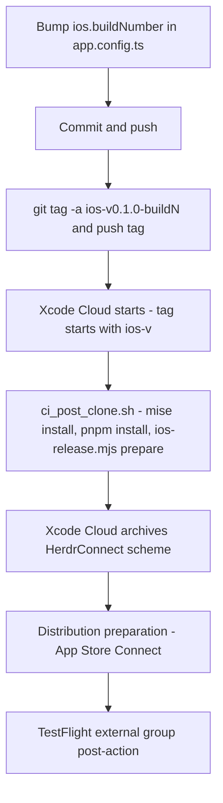
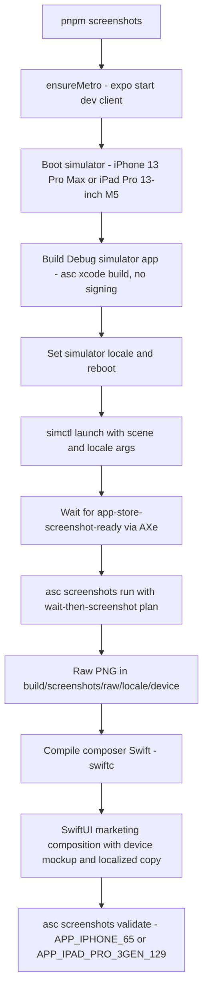

# Mobile Release Pipeline

The mobile app (`apps/mobile`) ships to iOS TestFlight primarily through **Xcode Cloud**, triggered by pushing an `ios-v*` tag (see `docs/release/ios-release-process.md`). A fully local path also exists — Xcode tooling driven by the App Store Connect CLI (`asc`) via `scripts/ios-release.mjs` — and Xcode Cloud itself reuses that script's `prepare` step. App Store screenshots are generated from **fixture data rather than a live daemon**. The GitHub Actions workflow for Android releases has signing secrets that are **not yet configured**, so it is manual-dispatch-only and effectively dormant.

There is **no fastlane setup** today: no `fastlane/` directory, Fastfile, or Appfile exists in the repository, and `docs/maintainers/releasing.md` explicitly states that iOS releases use Xcode plus `asc` and do not rely on EAS cloud builds, Ruby, or Fastlane. Fastlane is only mentioned historically in release docs; treat any fastlane reference as superseded.

## iOS release tracks

iOS deliberately does **not** share the daemon's `v*` tag scheme: daemon and Android share one combined GitHub Release per `v*` tag, while iOS uses its own `ios-v*` tag prefix that triggers a separate Xcode Cloud workflow instead of GitHub Actions. Reusing `v*` would archive an iOS build on every daemon-only tag, and a forgotten `buildNumber` bump on an unrelated tag would fail the Xcode Cloud upload outright (App Store Connect rejects a re-used build number for the same app version). Daemon/app compatibility is enforced at runtime by the `api_version` handshake (`daemon_outdated` / `app_outdated` in `apps/mobile/src/i18n/errors.ts`), not by aligning version numbers across platforms.



The Xcode Cloud release track from a buildNumber bump to the external TestFlight group.

The Xcode Cloud path: a maintainer bumps `ios.buildNumber` (nothing bumps it automatically — `expo prebuild` in every Xcode Cloud run writes the static value into `Info.plist`, so an unbumped retag fails the upload rather than silently reusing the old build), commits, then pushes a new annotated tag `ios-v<version>-build<buildNumber>`. **Never move or re-push an existing tag** — Xcode Cloud triggers on tag creation, and a force-moved tag may not re-trigger. The Xcode Cloud workflow itself is configured entirely in App Store Connect (Start Condition: tag starts with `ios-v`; Distribution Preparation: `App Store Connect`, not internal-only; post-action `TestFlight (External Testing)` targeting the external group with the public TestFlight link) — the only repo-side piece is `apps/mobile/ios/ci_scripts/ci_post_clone.sh`, which installs mise, runs `pnpm install --frozen-lockfile`, and runs `node scripts/ios-release.mjs prepare`.

The first submission to a given external group required Beta App Review; the public external test group has already passed it (invite link `https://testflight.apple.com/join/ZkRzJ6rm`). Later builds to the same group with no metadata changes are typically automatic.

## Maintainer-facing entrypoints

`docs/maintainers/releasing.md` and `docs/release/ios-release-process.md` are the canonical runbooks. The former documents the local flow:

```sh
cd apps/mobile
pnpm release:ios:prepare
pnpm release:ios:build
pnpm release:ios:upload

# screenshot generation (requires: brew install cameroncooke/axe/axe)
pnpm screenshots            # full pipeline
pnpm screenshots:marketing  # recompose marketing images only
pnpm screenshots:raw        # raw simulator captures only
```

Before a release, maintainers must increment `ios.buildNumber` in `apps/mobile/app.config.ts` and configure the Apple Team ID and App Store Connect API key locally (the `.p8` key must never be committed). The app config also pins the native project name to `"Herdr Connect"` (sanitizing to the `HerdrConnect` workspace/scheme that `ios-release.mjs` and Xcode Cloud hardcode) and sets the App Store display name to `Crozier` via `CFBundleDisplayName`.

## Local iOS flow: `scripts/ios-release.mjs`

A Node CLI with four subcommands, all of which first run `validateConfig()` — it reads the Expo config as JSON and enforces four invariants before anything else touches Xcode:

- `ios.bundleIdentifier` must be exactly `com.tomyail.herdrconnect`
- `ios.buildNumber` must be a non-empty digit string
- `ios.infoPlist.ITSAppUsesNonExemptEncryption` must be explicitly `false` (export-compliance)
- `ios.infoPlist.NSPhotoLibraryUsageDescription` must be a non-empty string

- **prepare** — runs `expo prebuild --platform ios --no-install` (with `--clean` if `EXPO_PREBUILD_CLEAN` is truthy), then `pod install` (via `bundle exec` locally, plain `pod` when `CI_XCODE_CLOUD=TRUE`), and fails if `ios/HerdrConnect.xcworkspace` is still missing afterwards.
- **build** — requires `APPLE_DEVELOPMENT_TEAM`; archives the `HerdrConnect` scheme (Release configuration) and exports an App Store Connect IPA via `asc xcode archive` / `asc xcode export --method app-store-connect`, passing `-allowProvisioningUpdates` and an optional `DEVELOPMENT_TEAM=` xcodebuild flag. Artifacts land in `apps/mobile/build/ios/` (`HerdrConnect.xcarchive`, `HerdrConnect.ipa`).
- **upload** — uploads the IPA with `asc builds upload --wait`; `IPA_PATH` can override the default path.
- **distribute** — publishes to TestFlight groups. Requires `TESTFLIGHT_CHANGELOG` and a comma-separated `TESTFLIGHT_GROUPS`; uses `ios.buildNumber` (or `TESTFLIGHT_BUILD_NUMBER`) as the build number. `TESTFLIGHT_NOTIFY=1` adds `--notify`, and `TESTFLIGHT_EXTERNAL=1` adds `--submit --confirm` to submit for Beta App Review. (In the Xcode Cloud track this step's role is covered by the workflow's `TestFlight (External Testing)` post-action instead.)

## App Store screenshots

App Store screenshots never connect to a real daemon and never touch the developer's paired credentials. Instead, a Debug-only harness renders the **production UI components** against a frozen in-memory connection snapshot.

### Fixture data: `src/screenshot-fixtures.ts`

Defines three scenes — `agents`, `detail`, `settings` (`ScreenshotSceneName`, parsed from launch arguments by `parseScreenshotScene`) — plus stable fake data: a `DiscoveredService` (`MacBook Pro · Daemon`, port 9808), four agents in different interaction states (`working`, `ready_input`, `blocked`), an `AgentsResponse` with `source_online: true`, two `DeviceCredentials` instances (fake fingerprints/tokens), and history markdown whose copy is locale-aware (`createScreenshotHistory` accepts `"en"` or `"zh-Hans"`). `createScreenshotConnection()` returns a `ConnectionValue` in the `connected` phase with `streamStatus: "live"` and **all callbacks as deliberate no-ops** (`refresh`, `switchAgent`, `unpair`, `switchInstance`, `forgetInstance`), so screenshot runs never touch a real daemon and cannot mutate the developer's credentials.

### Debug-only scene: `src/AppStoreScreenshotScene.tsx`

`App.tsx` computes `screenshotScene` only when `__DEV__` is true — the screenshot route cannot activate in a production bundle. When a scene is active, `App` also pins the theme to light, the i18n language to the launch-argument locale, and a fixed time label (`9:41 AM` / `09:41`).

`AppStoreScreenshotScene` wraps the **real** production components (`AgentsScreenContent`, `AgentDetailBody`, `SettingsScreen`, `SplitLayout`) in a `ConnectionFixtureProvider` seeded with the fixture connection — it is a UI harness, not a duplicate product surface. Wide layouts (iPad) route through the production `SplitLayout`; narrow devices render dedicated detail/settings compositions. The root view carries `accessibilityLabel="app-store-screenshot-ready"`, which the capture script uses as its readiness signal.

### Native launch-argument bridge: `modules/screenshot-launch-options`

An Expo native module (iOS-only) that exposes simulator launch arguments to JavaScript. The Swift `ScreenshotLaunchOptionsModule.get()` reads `ProcessInfo.processInfo.arguments` for `-appStoreScreenshotScene` and `-appStoreScreenshotLocale` and returns them as `{scene, locale}`. Keeping the arguments native means `xcrun simctl launch` can select a scene **without rebuilding the JS bundle** per screenshot. The JS wrapper (`index.ts`) resolves the module only on iOS and swallows all failures, so Expo Go, Android, and production builds load fine without it.

### Capture pipeline: `scripts/ios-screenshots.mjs`



End-to-end screenshot capture pipeline.

The pipeline: Metro serves the Debug bundle, two simulators capture fixture scenes, and a local SwiftUI composer produces the marketing frames that `asc` validates against App Store display-type requirements.

Key mechanisms:

- **Devices**: only two simulators are ever used — `iPhone 13 Pro Max` (its 1284×2778 output fits the `APP_IPHONE_65` slot; newer Pro Max devices produce the separate 6.9-inch slot) and `iPad Pro 13-inch (M5)` (`APP_IPAD_PRO_3GEN_129`).
- **Determinism**: before capture, the script overrides the simulator status bar (time `9:41`, 100% charged battery, full Wi-Fi), sets light appearance, and writes `AppleLanguages`/`AppleLocale` defaults followed by a **reboot** so iPadOS status-bar dates follow the screenshot locale rather than the host locale.
- **Readiness detection**: it polls `axe describe-ui` for the `app-store-screenshot-ready` label (or the localized Agents-overview heading), auto-tapping a "Development Server" button if Expo Dev Client shows one, up to 40 attempts.
- **Scene selection**: the app is launched directly by `simctl launch` with `-appStoreScreenshotScene`/`-appStoreScreenshotLocale` plus flags hiding the Expo Dev Menu floating button. Because `asc screenshots capture` would relaunch the app and drop those arguments, the script instead writes an `asc` plan containing only `wait` + `screenshot` steps and runs `asc screenshots run --plan`, leaving the already-launched process alive with the chosen fixture scene.
- **Matrix**: default run is 2 devices × 2 locales (`en-US`, `zh-Hans`) × 3 scenes = 12 raw PNGs; `--device`, `--scene`, `--locale`, `--skip-build`, `--raw-only`, `--compose-only` narrow it. Raw images go to `apps/mobile/build/screenshots/raw/`, marketing images to `apps/mobile/build/screenshots/marketing/` (both git-ignored).

### Marketing composition: `scripts/compose_app_store_screenshots.swift`

A standalone Swift executable (compiled ad hoc with `xcrun swiftc -parse-as-library`, binary cached at `build/screenshots/screenshot-composer`) invoked as `RAW_DIR OUTPUT_DIR LOCALE DEVICE`. It renders each raw scene PNG inside a device mockup (device-specific canvas 1284×2778 / 2064×2752, corner radii, bezels) beneath a localized marketing header (kicker, two-line display title, subtitle) using `ImageRenderer` at scale 1, and writes PNGs atomically. Copy is defined per locale per scene (`en-US` and `zh-Hans` dictionaries). A missing scene PNG is tolerated (so `--scene agents` runs succeed) but an unreadable image or render failure throws. After composition, `ios-screenshots.mjs` runs `asc screenshots validate --device-type APP_IPHONE_65|APP_IPAD_PRO_3GEN_129` so non-conforming images fail the pipeline immediately.

## Android release: `.github/workflows/android-release.yml`

The Android release is **not publicly available yet**; `docs/maintainers/releasing.md` forbids claiming a downloadable APK until a real signed artifact is attached to a GitHub Release and verified. Packaging/signing preparation notes live in `docs/release/android-apk.md`.

The workflow currently:

- Triggers **only via `workflow_dispatch`** with a required `tag` input (an existing GitHub Release tag). Tag-push auto-triggering is deliberately disabled: the release-keystore secrets (`ANDROID_KEYSTORE_BASE64`, `ANDROID_KEYSTORE_PASSWORD`, `ANDROID_KEY_ALIAS`, `ANDROID_KEY_PASSWORD`, `ANDROID_SIGNING_CERT_SHA256`) are **not yet configured**, so automatic triggers would deterministically fail. The comment at the top of the file records this.
- Validates the tag against `^v[0-9A-Za-z._-]+$` and names artifacts `herdr-connect-<tag>-android(.apk|.aab|-SHA256SUMS)`.
- **Idempotence**: queries the existing GitHub Release assets first and skips the whole build if all three artifacts are already present.
- Decodes the base64 keystore to the runner temp dir (mode 600, verified non-empty, deleted in an `always()` cleanup step) and fails fast if any of the five secrets is missing.
- Builds and verifies via `apps/mobile/scripts/android-release.sh`, renames the checksum manifest to avoid clobbering the daemon release's `SHA256SUMS`, uploads workflow artifacts (14-day retention), **waits up to 30 × 10s for the daemon release workflow to create the GitHub Release**, then `gh release upload --clobber` the APK/AAB/checksums.
- Uses concurrency group `android-release-<tag>` with `cancel-in-progress: false`, and `permissions: contents: write`.

## Related pages

- `/openwiki/development/setup.md` — workspace setup
- `/openwiki/mobile/ios-client.md` — the iOS client itself
- `/openwiki/cli/commands.md` — the `herdr-connect` CLI (daemon) release flow
