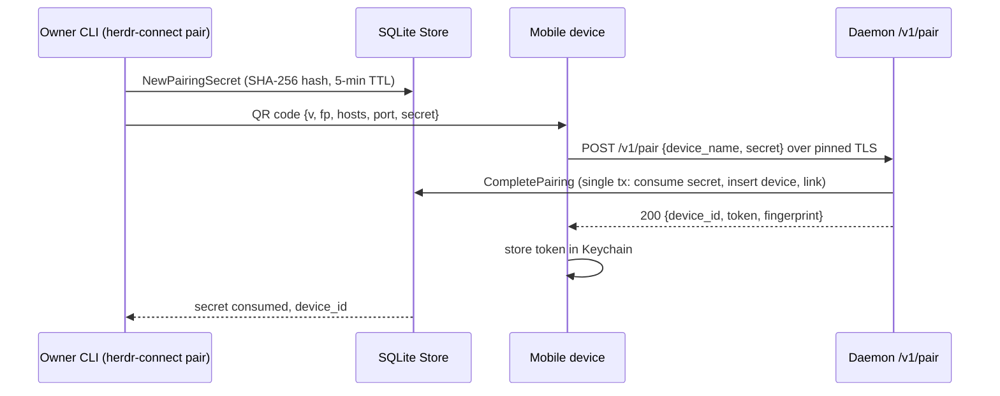
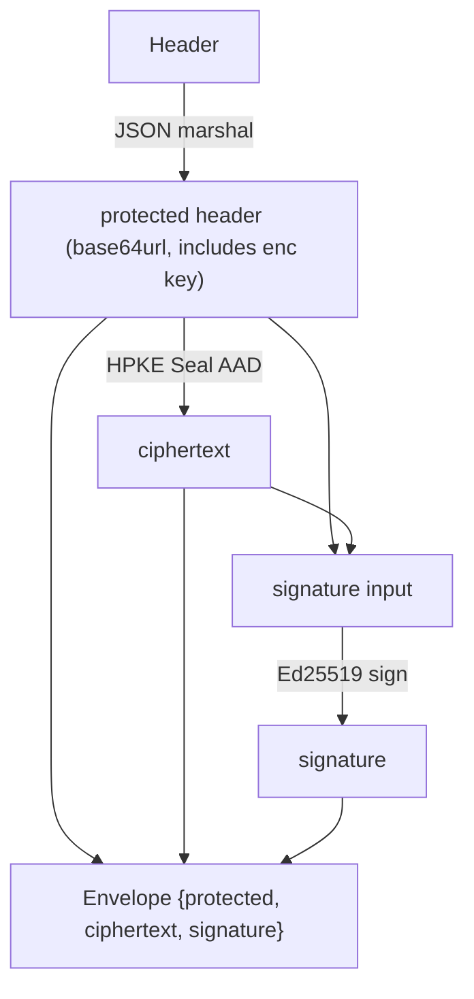
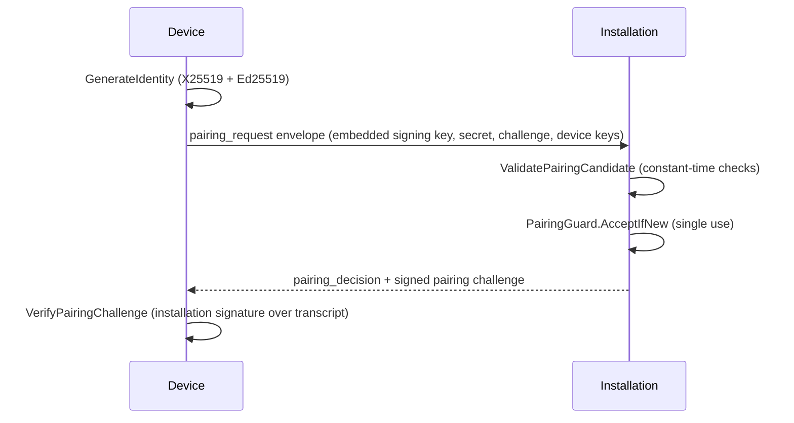

# Secure Pairing & TLS Protocol

This page documents two security layers:

1. **LAN Security (Implemented)** — TLS with self-signed certificate, fingerprint pinning, QR-code pairing, per-device bearer tokens, and device revocation. This is the active security model for all LAN communication today.
2. **End-to-End Encryption (Future)** — Protocol v1 HPKE envelope primitives in `/protocol/protocol.go` for future relay connections. Not yet integrated into the transport; trusted remote connection is not a current milestone.

For the authoritative human-readable security model, see `/docs/security/lan-tls-pairing.md` in the repository.

## LAN Security (Implemented)

### TLS & Certificate Pinning

All daemon traffic is HTTPS (TLS 1.2 minimum) using a **self-signed ECDSA P-256 certificate** generated on first launch by the [LAN auth layer](#lan-auth-layer) (`lanauth.LoadOrCreateCertificate`). The certificate is valid for 10 years and stored as `lan-cert.pem` / `lan-key.pem` next to the SQLite database.

Mobile devices do **not** perform standard CA-chain or hostname validation. Instead, they pin the **SHA-256 fingerprint of the certificate's DER encoding** (base64 RawURL). This fingerprint is:

- Returned in the `POST /v1/pair` response
- Advertised in the `fp` mDNS/Bonjour TXT record

If the certificate files are deleted or regenerated, the fingerprint changes and all previously paired devices must re-pair. The fingerprint serves as the stable installation identity.

On iOS, this pinning-only model requires disabling App Transport Security entirely (`NSAllowsArbitraryLoads: true` in `apps/mobile/app.config.ts`): iOS runs its own CA-chain/hostname ATS evaluation independently of the `URLSessionDelegate` trust decision, and that evaluation rejects the SAN-less self-signed certificate on non-"local network" paths such as a Tailscale tunnel (error `-9802`) before the fingerprint match is consulted. With ATS disabled, `PinnedTrustEvaluator` (see [iOS Mobile Client](../mobile/ios-client.md)) is the sole trust decision on every network path — safe here because ATS's CA/hostname checks never did meaningful work against a certificate that is self-signed by design. ATS exceptions cannot be scoped by IP range, only by domain (`NSExceptionDomains`). Details in `/docs/security/lan-tls-pairing.md` ("iOS App Transport Security").

### Pairing Flow

Pairing uses a QR code containing a one-time secret:

1. **Owner initiates** — `herdr-connect pair` generates a 32-byte random secret, stores only its **SHA-256 hash** in `pairing_secrets` with a 5-minute TTL, and renders a QR code in the terminal
2. **QR payload** — `{v:1, fp, hosts[], port, secret}` containing the certificate fingerprint, LAN host addresses, port (9808), and plaintext secret. With `herdr-connect pair --host IP_ADDRESS` the `hosts` array is narrowed to that single active local address (e.g. the host's Tailscale address to pair off-LAN); see [CLI Commands](../cli/commands.md)
3. **Mobile scans** — The [iOS client](../mobile/ios-client.md) scans the QR, POSTs `{device_name, secret}` to `POST /v1/pair` via pinned-fetch, validating the cert fingerprint during the TLS handshake
4. **Server consumes** — `lanauth.CompletePairing` runs a single SQLite transaction: conditionally consumes the secret (must exist, be unconsumed, not expired), inserts a new `paired_devices` row with a fresh per-device token (stored as SHA-256 hash)
5. **Token returned once** — The plaintext bearer token is returned exactly once in the pairing response, stored by the mobile client in iOS Keychain, and never persisted or logged in cleartext

Pairing is auto-approved (scanning a QR visible only on the host's physical screen is the out-of-band confirmation). The single-transaction `CompletePairing` is the seam where a future explicit confirm step would go.



The QR-to-token handshake; only hashes of the secret and token ever touch SQLite.

### Bearer-Token Authentication

Every endpoint except `/v1/pair` requires `Authorization: Bearer <token>`. The auth middleware (`/internal/demolan/auth.go`) hashes the incoming token and calls `lanauth.Authenticate`, which returns a three-state result:

- **`AuthStatusMissing`** — Token absent, unknown, or DB error → `401 unauthorized`
- **`AuthStatusRevoked`** — Token valid but device revoked → `401 revoked` (distinct so mobile can show "pair again")
- **`AuthStatusOK`** — Device active, `last_seen_at_ms` touched, request proceeds

Plaintext tokens are never stored — only SHA-256 hashes persist in SQLite.

### Rate Limiting

The daemon enforces token-bucket rate limits (`/internal/demolan/rate_limit.go`):

| Scope | Rate | Burst | Applies to |
|-------|------|-------|------------|
| Per-device reads | 5 req/s | 10 | Authenticated GET requests |
| Per-device writes | 1 req/s | 3 | Authenticated POST requests (focus, messages, interrupt) |
| Per-IP | 1 req/s | 20 | `/v1/pair` + all unauthenticated (401) requests |

Exceeded limits return `429 Too Many Requests` with `Retry-After: 1`.

### Bidirectional API Version Gates

The daemon and mobile client perform mutual version compatibility checks to ensure paired devices can communicate:

**Daemon → Client** (`/internal/demolan/auth.go` — `enforceClientVersion`):
- Every request may include `X-Herdr-Connect-Client-Version: <n>`. If present and below `MinSupportedClientVersion` (currently 1), the daemon responds with `426 Upgrade Required` + `client_outdated` — **before** auth or rate-limiting checks, so an outdated unpaired client sees "update your app" rather than a misleading auth error. A missing header is allowed through (backward compat for curl and health probes); a non-numeric header is rejected.

**Client → Daemon** (mobile `agent-contract.ts` — `assertDaemonSupported`):
- Every daemon response includes `api_version` in the JSON body and `X-Herdr-Connect-Api-Version` in headers. The client validates this against `MIN_SUPPORTED_DAEMON_API_VERSION` (currently 1). If the daemon is too old, the client enters a terminal `daemon_outdated` state.

Both checks produce terminal states that require a user upgrade — retry is not attempted.

### Device Lifecycle

Paired devices are managed via the `herdr-connect devices` CLI (see [CLI Commands](../cli/commands.md)):

- **List** — Shows all paired devices with status (active/revoked), paired/last-seen timestamps
- **Revoke** — Sets `revoked_at_ms`; subsequent requests with that token get `401 revoked`. Idempotent: revoking an already-revoked device returns an error.

Revocation is also possible **from the device itself**: `DELETE /v1/device` (`/internal/demolan/auth.go` — `handleSelfRevoke`, issue #52) lets an authenticated device revoke itself. The `deviceID` is derived from the bearer token by the auth middleware — the client passes no identifier, so a device can only revoke itself, never another device. It reuses the same `lanauth.RevokeDevice` storage path as the CLI, so semantics are identical: the very next request with that token receives `401 revoked`.

Revocation is host-side only. The mobile client detects the `401 revoked` status, clears local credentials, and surfaces a "revoked" UI state prompting re-pairing.

### LAN Auth Layer

The `/internal/lanauth/` package owns all security logic independent of HTTP:

- **Certificate identity** — `LoadOrCreateCertificate` generates and manages the self-signed ECDSA P-256 cert with race-safe concurrent first-generation (O_CREATE|O_EXCL lock)
- **Secret/token lifecycle** — `NewPairingSecret` (issue), `CompletePairing` (consume + issue token), `Authenticate` (validate)
- **Revocation** — `RevokeDevice` sets the revoked timestamp

It does **not** depend on `net/http` — HTTP route mapping and status code selection live in `/internal/demolan/`.

### Store Schema v2

Pairing data lives in two SQLite tables introduced by schema migration v2 (`/internal/store/pairing.go`):

```sql
CREATE TABLE paired_devices (
    device_id       TEXT PRIMARY KEY,
    name            TEXT NOT NULL,
    token_hash      BLOB NOT NULL UNIQUE,
    paired_at_ms    INTEGER NOT NULL,
    last_seen_at_ms INTEGER,
    revoked_at_ms   INTEGER
);

CREATE TABLE pairing_secrets (
    secret_hash    BLOB PRIMARY KEY,
    created_at_ms  INTEGER NOT NULL,
    expires_at_ms  INTEGER NOT NULL,
    consumed_at_ms INTEGER,
    device_id      TEXT REFERENCES paired_devices(device_id)
);
```

These are intentionally separate from the schema v1 `devices`/`device_cursors` tables (which store Ed25519/X25519 keypairs for the future HPKE relay milestone).

## End-to-End Encryption (Future — Protocol v1)

The Go `/protocol` package implements the **Protocol v1** wire primitives: HPKE envelope sealing/opening, Ed25519 signatures, replay protection, and the pairing-challenge flow, for **future end-to-end encryption over remote relay connections**. It is not integrated into the current LAN transport — trusted remote connection is not a current milestone. A parallel TypeScript implementation lives in `/packages/protocol` for the mobile side; the two are held interoperable by cross-language conformance tests.

**Status**: Implemented as a library and conformance-tested; not yet wired into any transport, key storage, or pairing UI.

### Cipher Suite

A single fixed suite (`protocol.CipherSuite`), implemented via cloudflare/circl HPKE:

```
HPKE-X25519-HKDF-SHA256-CHACHA20POLY1305+Ed25519
```

- **KEM** — DHKEM-X25519-HKDF-SHA256 (key encapsulation)
- **KDF** — HKDF-SHA256 (key derivation, `hpkeInfo` domain separator)
- **AEAD** — ChaCha20Poly1305 (authenticated encryption)
- **Signatures** — Ed25519 (sender authentication, `signatureDomain` domain separator)

`GenerateIdentity` produces both keypairs for an installation or device: an X25519 HPKE encryption pair and an Ed25519 signing pair (private key stored as seed).

### Message Envelope



How `Seal` builds an envelope: the header is JSON-marshaled (canonical, base64url), used as HPKE associated data, and the protected bytes plus ciphertext are Ed25519-signed.

Message types (`MessageType`): `session_hello`, `pairing_request`, `pairing_decision`, `lifecycle_event`, `state_snapshot`, `output_request`, `output_snapshot`, `remote_command`, `command_result`, `ack`, `error`.

The protected header (JSON keys `v`, `suite`, `message_type`, `installation_id`, `sender_id`, `sender_signing_key_id`, `sender_signing_public_key`, `recipient_id`, `recipient_encryption_key_id`, `message_id`, `event_id`, `event_seq`, `through_event_seq`, `command_id`, `request_id`, `ack_seq`, `created_at_ms`, `expires_at_ms`, `enc`) carries routing identity, sequence cursors, and the HPKE encapsulated key. `Open` re-marshals the decoded header and requires **byte-identical canonical JSON** — non-canonical encodings are rejected as `invalid_envelope`.

### Header Validation Invariants

`validateHeader` enforces, independently of crypto:

- Version must equal 1 and suite must equal the fixed suite (`unsupported_version` / `unsupported_suite`)
- Message type must be known; each type has **message-type-specific field discipline**: e.g. `lifecycle_event` requires `event_id` + `event_seq` and forbids `command_id`/`request_id`/`ack_seq`; `remote_command`/`command_result` require `command_id` and forbid event fields; `ack` requires `ack_seq`; other types forbid all optional correlation fields (`invalid_header`)
- Identifiers must match `^[A-Za-z0-9][A-Za-z0-9._:-]{0,127}$`
- Sequence numbers and timestamps must stay within the interoperable 2^53−1 integer range
- `expires_at` must be after `created_at`, and the lifetime must not exceed a **per-type maximum TTL** (`ttl_exceeded`): 30s for `session_hello`/`output_request`/`output_snapshot`/`remote_command`; 5 min for pairing/`state_snapshot`/`command_result`/`ack`/`error`; 24 h for `lifecycle_event`

### Open Path: Verification Order

`Open` verifies in a deliberate order so failures are non-oracle and stable:

1. Decode + canonical-header check (`invalid_envelope`), header validation
2. Route binding: installation/sender/recipient IDs must match expectations (`wrong_route`)
3. Ed25519 signature over protected+ciphertext (`authentication_failed`) — except pairing requests, which bootstrapped the sender signing key from the embedded header field
4. Time gates: reject `created_in_future` beyond a 2-minute clock-skew tolerance, then reject `expired` at or past `expires_at`
5. HPKE open (AAD = protected header bytes); failure is `authentication_failed`, not a distinguishing error
6. Replay: caller-supplied `ReplayGuard.MarkIfNew(messageID, expiresAt)` for normal messages or `PairingGuard.AcceptIfNew` for pairing requests; duplicates yield `replay`, storage errors `replay_store_failed`

A missing replay/pairing guard is itself an error — replay protection is mandatory, not optional. Size limits: 256 KiB max plaintext (`MaxPlaintextSize`), 4 KiB max protected header; violations return `message_too_large`.

Error codes are a stable `ErrorCode` enum (`replay`, `ttl_exceeded`, `authentication_failed`, `unsupported_version`, `unsupported_suite`, `expired`, `unsupported_message_type`, `invalid_envelope`, `invalid_header`, `invalid_key`, `wrong_route`, `created_in_future`, `replay_store_failed`, `message_too_large`) surfaced through `ProtocolError`/`ErrorCodeOf`.

### Future Pairing Flow (Protocol v1)

Unlike today's auto-approved QR pairing, the Protocol v1 design has an interactive, key-bootstrapping pairing:



The future key-bootstrapping pairing: the device's first message embeds its Ed25519 public key (the only message type allowed to do so), and the installation answers with a signed challenge transcript binding both sides' signing and encryption keys plus the accept/reject decision.

- `ValidatePairingCandidate` decodes the pairing-request payload with `DisallowUnknownFields`, requires the 32-byte pairing secret, challenge, and both device public keys as base64url, compares the secret and embedded signing key in constant time, and limits device names to 1–128 valid UTF-8 runes.
- `PairingChallengeTranscript` builds a length-prefixed, domain-separated transcript over `pairing_id`, secret, challenge, both device keys, both installation keys, and the decision; `SignPairingChallenge`/`VerifyPairingChallenge` Ed25519-sign/verify it. This gives the device cryptographic proof that the installation accepted *these* keys, preventing key-substitution during pairing.

### Conformance & Test Vectors

Cross-language interop is enforced by:

- **`/cmd/protocol-conformance`** — a JSON-in/JSON-out CLI exposing `generate_identity`, `seal`, `open`, `open_replay`, `sign_pairing_challenge`, and `verify_pairing_challenge` over the Go package.
- **`/test/conformance.test.mjs`** — builds both the Go CLI and the TypeScript `/packages/protocol` conformance CLI and asserts both produce identical envelopes (deterministic via `ephemeral_key_material`) and identical error codes.
- **`/protocol/testdata/v1/envelope.json`** — a fixed interop vector (lifecycle event with pinned keys and ephemeral material) any implementation must reproduce byte-for-byte.
- **`/protocol/protocol_test.go`** — Go unit tests for round trips, replay rejection with a stable code, tampered ciphertext without an oracle, version rejection before crypto, expiry at the exact boundary, 30-second remote-command TTL, size limits, header field discipline, pairing-request key bootstrap, and pairing-challenge validation.

Run the Go tests with `go test ./protocol`; conformance with the repo's JS test runner.

### Relationship Between the Two Layers

Per `/docs/security/lan-tls-pairing.md`, both models reduce to "installation has a stable identity, devices hold revocable credentials granted at pairing time." The LAN transport substitutes a pinned certificate fingerprint for the Ed25519/X25519 identity and a bearer token for the per-device keypair, so a future migration to Protocol v1 reuses the same pairing concept and device/revocation storage shape — though no forward compatibility is promised; devices may need to re-pair.

## Resources

- **Specification** — `/docs/protocol/v1.md`
- **Conformance harness doc** — `/docs/protocol/conformance.md`
- **Go implementation** — `/protocol/protocol.go`
- **Go tests / vectors** — `/protocol/protocol_test.go`, `/protocol/testdata/v1/envelope.json`
- **Conformance CLI & tests** — `/cmd/protocol-conformance/main.go`, `/test/conformance.test.mjs`
- **LAN threat model** — `/docs/security/lan-tls-pairing.md`
